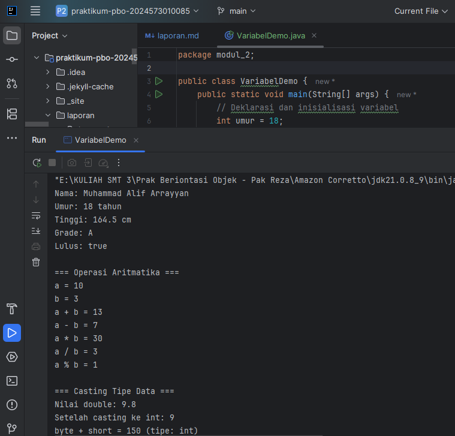

# Laporan Modul 2: Dasar Pemrograman Java
**Mata Kuliah:** Praktikum Pemrograman Berorientasi Objek
**Nama:** Muhammad Alif Arrayyan  
**NIM:** 2024573010085  
**Kelas:** Teknik Informatika - 2E

---

## 1. Abstrak
Laporan ini membahas konsep-konsep dasar dalam bahasa pemrograman Java yang mencakup variabel, tipe data, operator, 
struktur kontrol keputusan (if-else, switch-case), dan struktur kontrol perulangan (for, while, do-while). 
Tujuan dari laporan ini adalah untuk mendokumentasikan pemahaman dan hasil dari praktikum dasar-dasar Java 
sebagai fondasi untuk mempelajari pemrograman berorientasi objek lebih lanjut.

---
## 2. Praktikum
### Praktikum 1 - Variabel dan Tipe Data
#### Dasar Teori
#### Langkah Praktikum
#### Screenshoot Hasil
**VariabelDemo.Java**

#### Analisa dan Pembahasan

### Praktikum 2 - Input, Output dan Scanner
#### Dasar Teori
#### Langkah Praktikum
#### Screenshoot Hasil
**InputOutputDemo.Java**
#### Analisa dan Pembahasan

### Praktikum 3 - Struktur Kontrol: Percabangan
#### Dasar Teori
#### Langkah Praktikum
#### Screenshoot Hasil
**GradeDemo.Java**
**MenuDemo.Java**
**NestedIfDemo.Java**
#### Analisa dan Pembahasan

### Praktikum 4 - Struktur Kontrol: Perulangan
#### Dasar Teori
#### Langkah Praktikum
#### Screenshoot Hasil
**ForLoopDemo.Java**
**WhileLoopDemo.Java**
**NestedLoopDemo.Java**
#### Analisa dan Pembahasan

---

## 3. Kesimpulan

Tulis kesimpulan dari praktikum ini

---

## 5. Referensi
Cantumkan sumber yang Anda baca (buku, artikel, dokumentasi) — minimal 2 sumber. Gunakan format sederhana (judul — URL).

---