# Laporan Modul 2: Dasar Pemrograman Java

**Mata Kuliah:** Praktikum Pemrograman Berorientasi Objek   
**Nama:** Muhammad Alif Arrayyan  
**NIM:** 2024573010085  
**Kelas:** Teknik Informatika - 2E

---

## 1. Abstrak
Laporan ini membahas konsep-konsep dasar dalam bahasa pemrograman Java yang mencakup variabel, tipe data, operator, struktur kontrol keputusan (if-else, switch-case), dan struktur kontrol perulangan (for, while, do-while). Tujuan dari laporan ini adalah untuk mendokumentasikan pemahaman dan hasil dari praktikum dasar-dasar Java sebagai fondasi untuk mempelajari pemrograman berorientasi objek lebih lanjut.

---
## 2. Praktikum
### Praktikum 1 - Variabel dan Tipe Data
#### Dasar Teori
Variabel adalah sebuah nama yang digunakan sebagai wadah atau lokasi di dalam memori komputer untuk menyimpan sebuah nilai. Nilai yang disimpan ini dapat diubah selama program berjalan. Agar komputer tahu jenis nilai apa yang boleh disimpan, setiap variabel harus memiliki tipe data. Tipe data mendefinisikan jenis dan ukuran data, seperti int untuk bilangan bulat, double untuk bilangan desimal, char untuk satu karakter, dan String untuk kumpulan karakter atau teks. Deklarasi variabel dengan tipe data yang tepat sangat penting untuk memastikan operasi yang dilakukan pada data tersebut valid dan efisien.
#### Langkah Praktikum
1. Pertama-tama, di dalam package modul_2 tersebut, buatlah sebuah class Java baru dan simpan dengan nama VariabelDemo.java.
2. Setelah file berhasil dibuat, isikan dengan potongan kode yang telah disiapkan untuk mempraktikkan cara deklarasi variabel dan penerapan tipe data.
#### Screenshoot Hasil
**Program-VariabelDemo.Java**
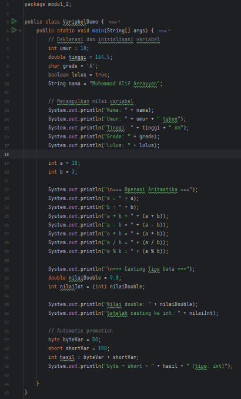
**Output-VariabelDemo.Java**
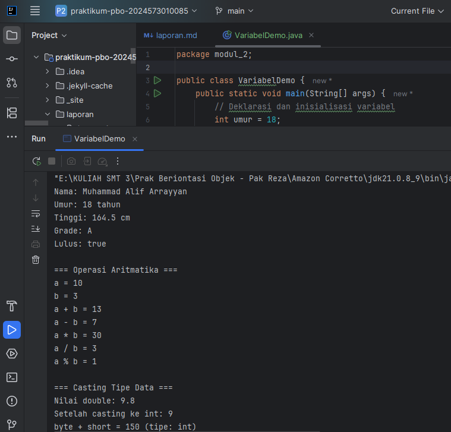
#### Analisa dan Pembahasan

### Praktikum 2 - Input, Output dan Scanner
#### Dasar Teori
Dalam pemrograman, Input adalah proses menerima data dari luar program, misalnya dari ketikan pengguna di keyboard. Sebaliknya, Output adalah proses mengirimkan data atau informasi dari dalam program ke luar, seperti menampilkannya di layar. Di Java, salah satu cara paling umum untuk menangani input dari pengguna adalah dengan menggunakan kelas Scanner. Kelas Scanner menyediakan fungsi-fungsi untuk membaca berbagai jenis data (seperti teks, angka, dll.) dari sumber input, sehingga program dapat berinteraksi dengan pengguna secara dinamis.
#### Langkah Praktikum
1. Awali praktikum ini dengan membuat sebuah file Java baru di dalam package modul_2 Anda, lalu berikan nama InputOutputDemo.java.
2. Di dalam file tersebut, implementasikan kode program yang memanfaatkan class Scanner untuk menangkap data yang diketik oleh pengguna melalui konsol.
#### Screenshoot Hasil
**Program-InputOutputDemo.Java**
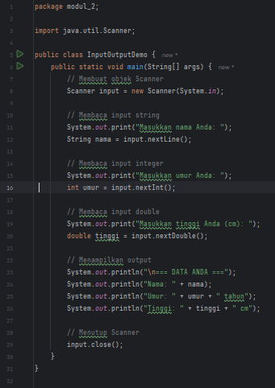
**Output-InputOutputDemo.Java**
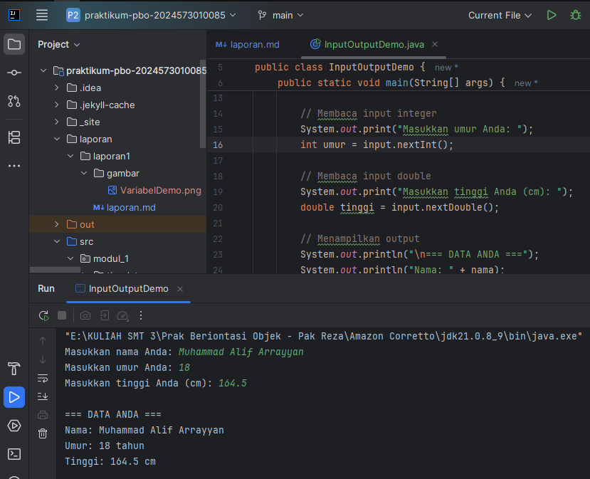
#### Analisa dan Pembahasan

### Praktikum 3 - Struktur Kontrol: Percabangan
#### Dasar Teori
Struktur Kontrol Percabangan adalah mekanisme dalam pemrograman yang memungkinkan alur eksekusi program untuk memilih jalur yang berbeda berdasarkan kondisi tertentu. Jika suatu kondisi bernilai benar (true), maka blok kode tertentu akan dieksekusi. Jika bernilai salah (false), blok kode tersebut akan dilewati atau blok kode alternatif yang akan dijalankan. Struktur ini adalah fondasi untuk membuat program yang dapat mengambil keputusan. Contoh paling umum dari struktur ini adalah perintah if-else dan switch-case.
#### Langkah Praktikum
1. Program Penentu Grade: Untuk studi kasus pertama, ciptakan file baru bernama GradeDemo.java. Di dalamnya, tuliskan logika program yang menggunakan struktur if-else if-else untuk mengonversi nilai menjadi sebuah predikat (misalnya, A, B, C).
2. Program Menu dengan Switch: Lanjutkan dengan membuat file bernama MenuDemo.java. Kali ini, manfaatkan switch statement untuk membangun sebuah sistem pemilihan menu yang sederhana dan efisien.
3. Program Nested If: Terakhir, buatlah file NestedIfDemo.java. Di sini, Anda akan mengimplementasikan sebuah program yang menggunakan if bersarang untuk menentukan kategori usia berdasarkan masukan dari pengguna.
#### Screenshoot Hasil
**Program-GradeDemo.Java**
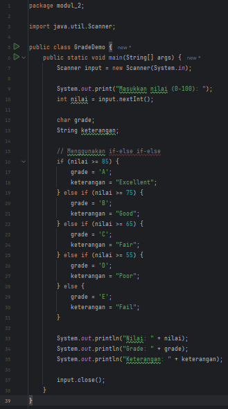
**Output-GradeDemo.Java**
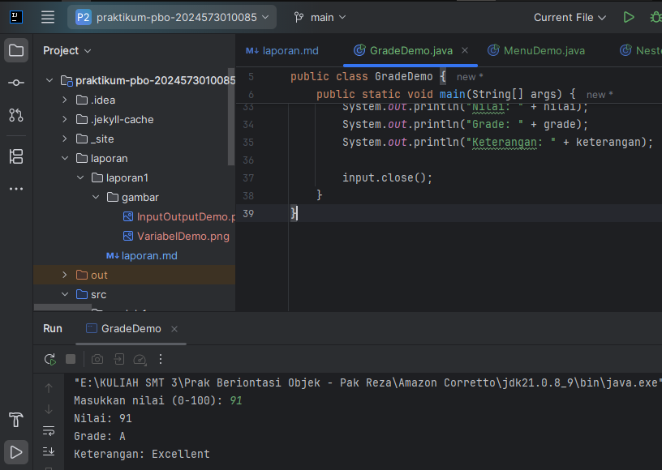
**Program-MenuDemo.Java**
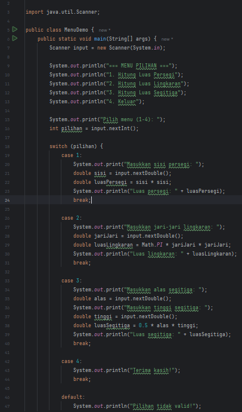
**Output-MenuDemo.Java**
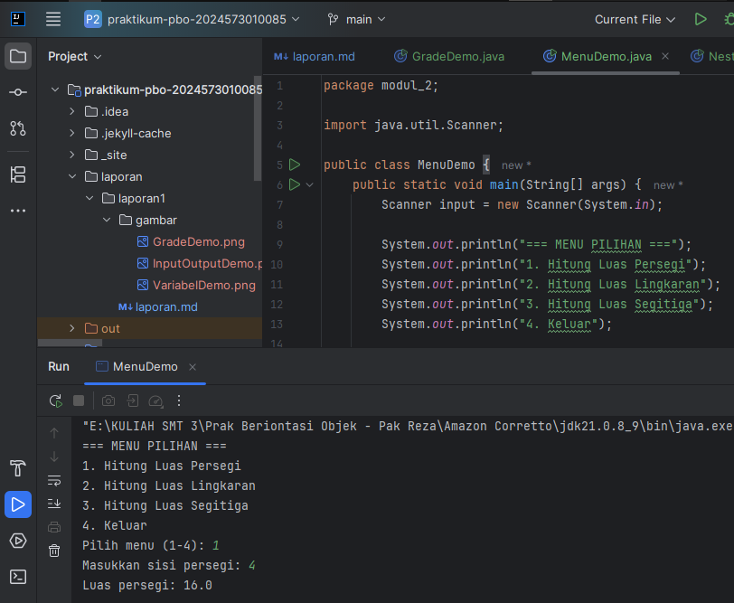
**Program-NestedIfDemo.Java**
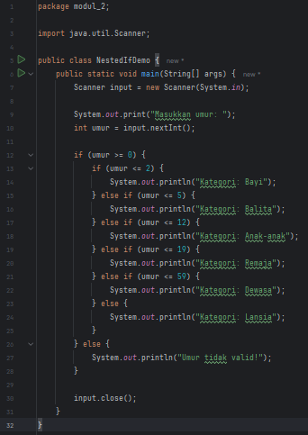
**Output-NestedIfDemo.Java**
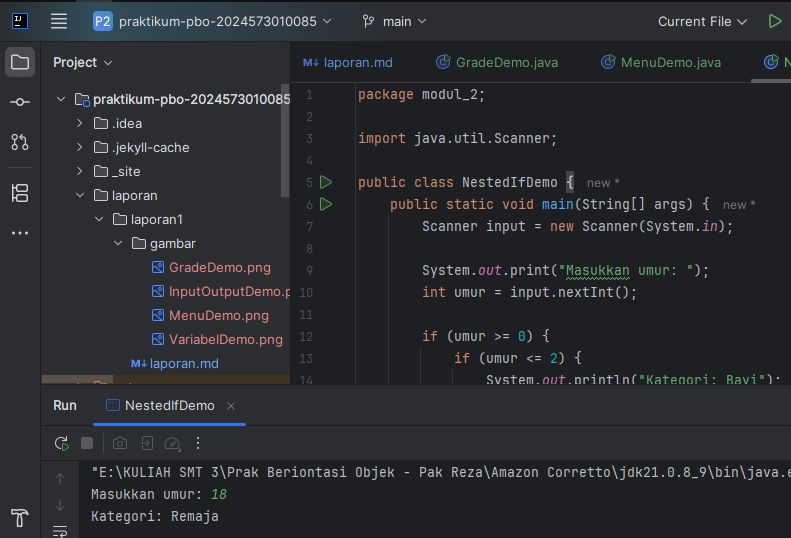
#### Analisa dan Pembahasan

### Praktikum 4 - Struktur Kontrol: Perulangan
#### Dasar Teori
Struktur Kontrol Perulangan (atau looping) digunakan untuk mengeksekusi blok kode yang sama secara berulang-ulang selama suatu kondisi masih terpenuhi. Ini sangat efisien untuk tugas-tugas yang repetitif, seperti memproses semua elemen dalam daftar atau menjalankan simulasi hingga mencapai target tertentu. Tanpa perulangan, kita harus menulis kode yang sama berkali-kali. Jenis-jenis perulangan yang umum digunakan di Java meliputi for, while, dan do-while, yang masing-masing memiliki cara tersendiri dalam mendefinisikan kondisi berhenti dan iterasinya.
#### Langkah Praktikum
1. Perulangan For: Silakan buat file baru bernama ForLoopDemo.java. Isilah file tersebut dengan berbagai contoh implementasi for loop untuk memahami strukturnya.
2. Perulangan While dan Do-While: Berikutnya, buat file bernama WhileLoopDemo.java. Tuliskan kode untuk mendemonstrasikan penggunaan while dan do-while, serta pahami perbedaan utama antara keduanya.
3. Nested Loop (Perulangan Bersarang): Sebagai penutup, buatlah sebuah file bernama NestedLoopDemo.java. Implementasikan contoh kode yang menunjukkan bagaimana perulangan bisa dijalankan di dalam perulangan lain untuk menyelesaikan masalah yang lebih kompleks.
#### Screenshoot Hasil
**Program-ForLoopDemo.Java**
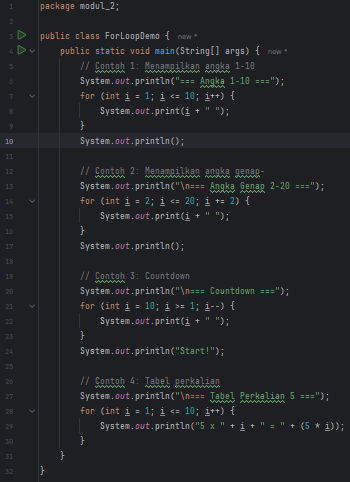
**Output-ForLoopDemo.Java**
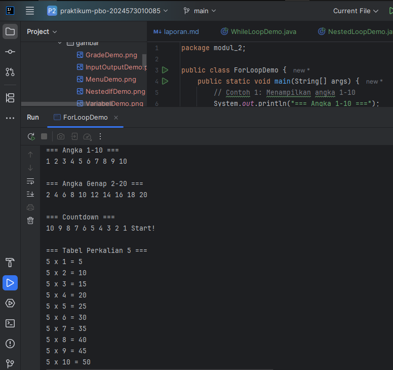
**Program-WhileLoopDemo.Java**
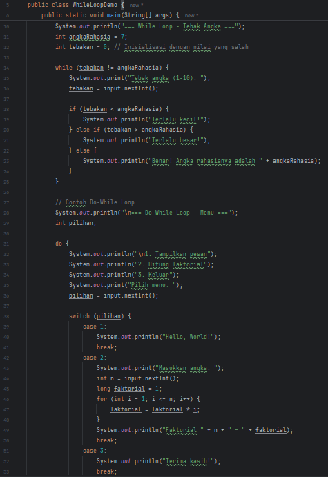
**Output-WhileLoopDemo.Java**
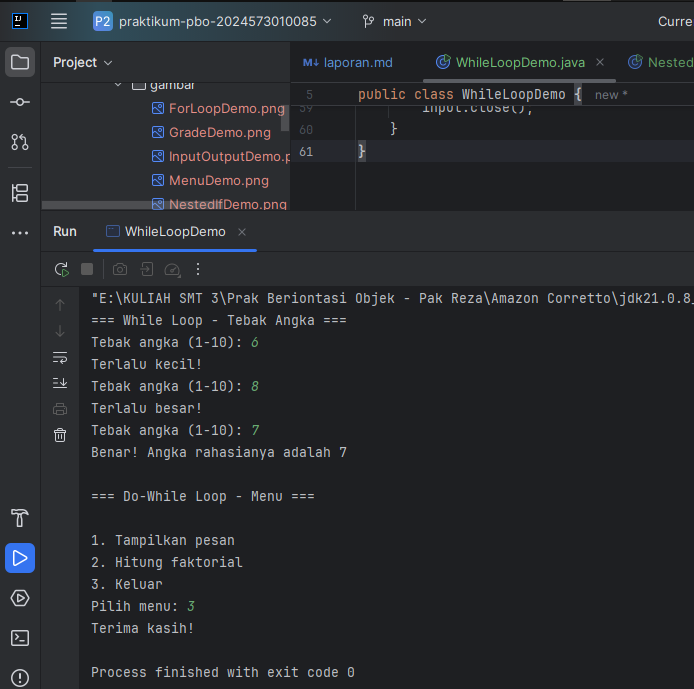
**Program-NestedLoopDemo.Java**
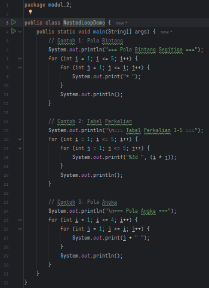
**Output-NestedLoopDemo.Java**
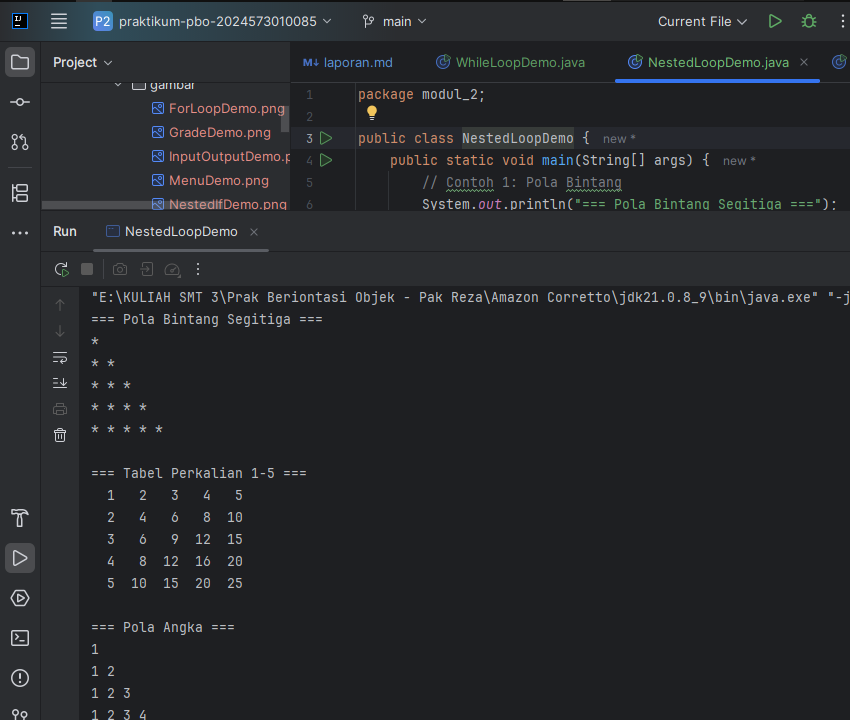
#### Analisa dan Pembahasan

---

## 3. Kesimpulan

Praktikum Modul 2 ini memberikan pemahaman yang esensial mengenai fondasi pemrograman Java. Melalui serangkaian latihan, praktikan telah berhasil memahami konsep inti mulai dari cara menyimpan data menggunakan variabel dan tipe data, hingga membuat program menjadi interaktif dengan mekanisme input dan output menggunakan class Scanner.

Lebih lanjut, praktikum ini juga melatih kemampuan logika dalam mengontrol alur eksekusi program melalui struktur percabangan (if-else, switch) untuk pengambilan keputusan, serta struktur perulangan (for, while, do-while) untuk menangani tugas-tugas repetitif secara efisien. Penguasaan konsep-konsep dasar ini merupakan pilar utama yang akan menjadi bekal untuk membangun aplikasi Java yang lebih kompleks dan fungsional di masa mendatang.

---

## 5. Referensi
Berikut adalah beberapa sumber yang relevan dengan materi praktikum:

1. W3Schools Java Tutorial — https://www.w3schools.com/java/
2. The Java™ Tutorials: Language Basics (Oracle Documentation) — https://docs.oracle.com/javase/tutorial/java/nutsandbolts/index.html
---