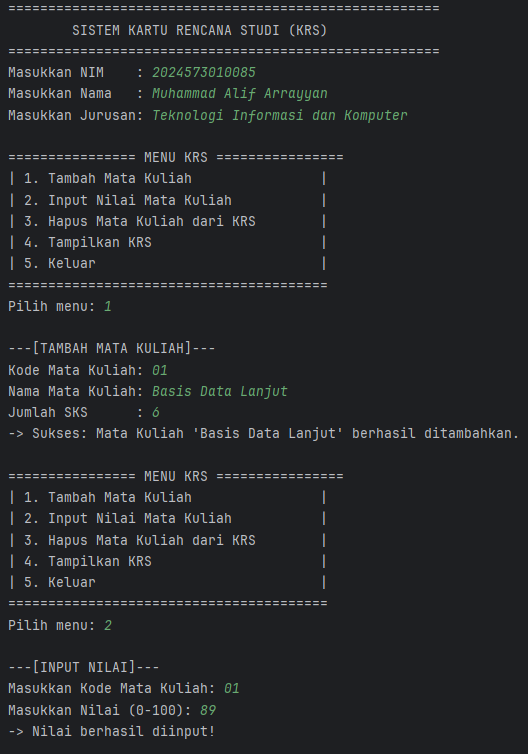
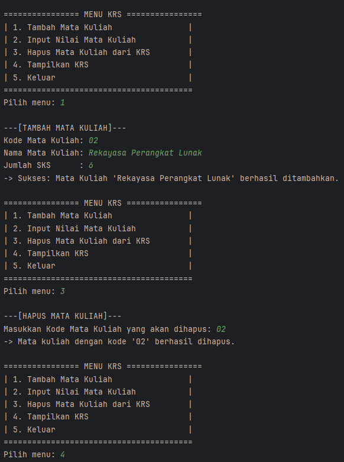
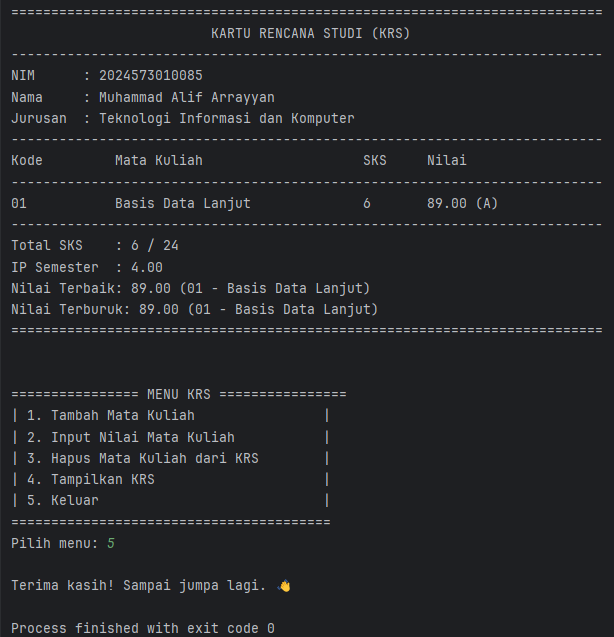

# Laporan Modul 4: Pengenalan Object Oriented Programming
**Mata Kuliah:** Praktikum Pemrograman Berorientasi Objek  
**Nama:** Muhammad Alif Arrayyan  
**NIM:** 2024573010085  
**Kelas:** TI-2E

---

## Abstrak
Modul ini dirancang untuk memberikan pemahaman dasar tentang pemrograman berorientasi objek menggunakan Java melalui praktikum langsung.
Setiap praktikum dilengkapi dengan teori dasar dan langkah-langkah implementasi yang detail.

## Praktikum : Dasar Class dan Object

### Dasar Teori
Objek-Oriented Programming (OOP) adalah paradigma pemrograman yang menggunakan “objek” - struktur data yang berisi data, dalam bentuk field, sering kali dikenal sebagai atribut; dan kode, dalam bentuk prosedur, sering kali dikenal sebagai metode.

Inti dari OOP adalah mendesain software dengan membagi masalah menjadi serangkaian objek yang saling berinteraksi. Ini bertentangan dengan pemrograman prosedural, yang fokus pada fungsi/prosedur dalam memproses data. OOP memungkinkan kita untuk membuat kode yang lebih modular, reusable, dan mudah di-maintain.

Konsep Dasar OOP:
Class: Template atau blueprint untuk membuat object
Object: Instance dari sebuah class
Attribute/Field: Variabel yang dimiliki oleh class
Method: Function yang dimiliki oleh class
Constructor: Method khusus untuk inisialisasi object

Prinsip OOP:
Encapsulation: Menyembunyikan detail implementasi
Inheritance: Pewarisan sifat dari class parent
Polymorphism: Kemampuan object untuk memiliki banyak bentuk
Abstraction: Menyederhanakan kompleksitas dengan menyembunyikan detail

Class dan Objek
kelas adalah konsep abstrak yang mendefinisikan set atribut dan metode yang akan dimiliki oleh object. Kelas menyediakan struktur atau template yang menentukan bagaimana sebuah object harus dibuat. Kelas akan menentukan jenis atribut dan metode apa yang akan dimiliki oleh object, tetapi tidak menentukan nilai dari atribut itu sendiri untuk object tertentu.

Object adalah inti dari pemrograman berorientasi objek. Setiap object memiliki dua karakteristik utama, yaitu:
Object, dalam konteks pemrograman OOP, adalah sebuah entitas yang memiliki karakteristik dan perilaku. Kelas, di sisi lain, merupakan blueprint atau cetakan untuk membuat object. Kalau kamu bandingkan dengan dunia nyata, kamu bisa menganggap kelas sebagai rencana desain bangunan, sedangkan object adalah bangunan yang sesungguhnya telah dibangun berdasarkan desain tersebut.

### Praktikum setelah dimodifikasi
1. Buat class baru bernama Mahasiswa
2. Buat class Mahasiswa dan isikan kode berikut:
```java
public class Mahasiswa {
    // Atribut/Field (private untuk encapsulation)
    private String nama;
    private String nim;
    private String jurusan;

    // Constructor dengan parameter
    public Mahasiswa(String nama, String npm, String jurusan, double ipk) {
        this.nama = nama;
        this.nim = npm;
        this.jurusan = jurusan;
    }

    // Getter methods
    public String getNama() {
        return nama;
    }

    public String getNim() {
        return nim;
    }

    public String getJurusan() {
        return jurusan;
    }
}

```
3. Buat class Matakuliah dan isikan kode berikut:
```java
public class MataKuliah {
    private String kode;
    private String nama;
    private int sks;
    private double nilai;

    // Constructor
    public MataKuliah(String kode, String nama, int sks) {
        this.kode = kode;
        this.nama = nama;
        this.sks = sks;
        this.nilai = 0.0;
    }

    // Getter dan Setter
    public String getKode() {
        return kode;
    }

    public String getNama() {
        return nama;
    }

    public int getSks() {
        return sks;
    }

    public double getNilai() {
        return nilai;
    }

    public void setNilai(double nilai) {
        if (nilai >= 0.0 && nilai <= 100.0) {
            this.nilai = nilai;
        } else {
            System.out.println("Nilai harus antara 0-100!");
        }
    }

    // Konversi nilai angka ke huruf
    public String getNilaiHuruf() {
        if (nilai >= 85) return "A";
        else if (nilai >= 80) return "A-";
        else if (nilai >= 75) return "B+";
        else if (nilai >= 70) return "B";
        else if (nilai >= 65) return "C+";
        else if (nilai >= 60) return "C";
        else if (nilai >= 55) return "D";
        else return "E";
    }

    // Konversi nilai huruf ke bobot
    public double getBobotNilai() {
        String huruf = getNilaiHuruf();
        switch (huruf) {
            case "A":  return 4.0;
            case "A-": return 3.7;
            case "B+": return 3.3;
            case "B":  return 3.0;
            case "C+": return 2.7;
            case "C":  return 2.3;
            case "D":  return 2.0;
            case "E":  return 0.0;
            default:   return 0.0;
        }
    }

    // Menampilkan informasi mata kuliah
    public void tampilkanInfo() {
        System.out.printf("Kode: %-10s Nama: %-30s SKS: %d Nilai: %.2f (%s)%n",
                kode, nama, sks, nilai, getNilaiHuruf());
    }
}

```
4. Buat class RencanaKartuStudi dan isikan berikut:
```java
public class KartuRencanaStudi {
    private Mahasiswa mahasiswa;
    private MataKuliah[] daftarMataKuliah;
    private int jumlahMataKuliah;
    private int maxMataKuliah;

    public KartuRencanaStudi(Mahasiswa mahasiswa, int maxMataKuliah) {
        this.mahasiswa = mahasiswa;
        this.maxMataKuliah = maxMataKuliah;
        this.daftarMataKuliah = new MataKuliah[maxMataKuliah];
        this.jumlahMataKuliah = 0;
    }

    // Menambahkan mata kuliah ke KRS
    public boolean tambahMataKuliah(MataKuliah matkul) {
        if (jumlahMataKuliah < maxMataKuliah) {
            daftarMataKuliah[jumlahMataKuliah++] = matkul;
            System.out.println("\nNote: Mata Kuliah " + matkul.getNama() + " berhasil ditambahkan.");
            return true;
        } else {
            System.out.println("\nNote: KRS sudah penuh! Maksimal = " + maxMataKuliah + " mata kuliah.");
            return false;
        }
    }

    // Menghitung total SKS
    public int hitungTotalSKS() {
        int totalSKS = 0;
        for (int i = 0; i < jumlahMataKuliah; i++) {
            totalSKS += daftarMataKuliah[i].getSks();
        }
        return totalSKS;
    }

    // Menghitung IPK
    public double hitungIPK() {
        if (jumlahMataKuliah == 0) return 0.0;

        double totalBobot = 0.0;
        int totalSKS = 0;

        for (int i = 0; i < jumlahMataKuliah; i++) {
            MataKuliah mk = daftarMataKuliah[i];
            totalBobot += mk.getBobotNilai() * mk.getSks();
            totalSKS += mk.getSks();
        }

        return totalSKS > 0 ? totalBobot / totalSKS : 0.0;
    }

    // Menampilkan KRS
    public void tampilkanKRS() {
        System.out.println("===============================================");
        System.out.println("             KARTU RENCANA STUDI (KRS)");
        System.out.println("===============================================");
        System.out.println("Nama Mahasiswa : " + mahasiswa.getNama());
        System.out.println("NIM            : " + mahasiswa.getNim());
        System.out.println("Jurusan        : " + mahasiswa.getJurusan());
        System.out.println("-----------------------------------------------");
        System.out.println("MATA KULIAH\t\t\tSKS\tNILAI");
        System.out.println("-----------------------------------------------");

        if (jumlahMataKuliah == 0) {
            System.out.println("Belum ada mata kuliah yang diambil.");
        } else {
            for (int i = 0; i < jumlahMataKuliah; i++) {
                daftarMataKuliah[i].tampilkanInfo();
            }
        }

        System.out.println("-----------------------------------------------");
        System.out.println("Total SKS     : " + hitungTotalSKS());
        System.out.printf("IP Semester   : %.2f%n", hitungIPK());
        System.out.println("===============================================");
    }

    // Mencari MataKuliah berdasarkan kode
    public MataKuliah cariMataKuliah(String kode) {
        for (int i = 0; i < jumlahMataKuliah; i++) {
            if (daftarMataKuliah[i].getKode().equalsIgnoreCase(kode)) {
                return daftarMataKuliah[i];
            }
        }
        return null;
    }
}

```
5. Buat class Main untuk menguji:
```java
import java.util.Scanner;

public class Main {
    public static void main(String[] args) {
        Scanner input = new Scanner(System.in);

        System.out.println("===============================================");
        System.out.println("      SISTEM KARTU RENCANA STUDI (KRS)");
        System.out.println("===============================================");

        System.out.print("Nama Mahasiswa : ");
        String nama = input.nextLine();

        System.out.print("NIM : ");
        String nim = input.nextLine();

        System.out.print("Jurusan : ");
        String jurusan = input.nextLine();

        // Membuat objek mahasiswa
        Mahasiswa mhs = new Mahasiswa(nama, nim, jurusan, 0.0);

        // Membuat objek KRS (maksimal 10 mata kuliah)
        KartuRencanaStudi krs = new KartuRencanaStudi(mhs, 10);

        boolean running = true;

        while (running) {
            System.out.println("\n===============================================");
            System.out.println("                    MENU KRS");
            System.out.println("===============================================");
            System.out.println("1. Tambah Mata Kuliah");
            System.out.println("2. Input Nilai Mata Kuliah");
            System.out.println("3. Tampilkan KRS");
            System.out.println("4. Keluar");
            System.out.println("===============================================");
            System.out.print("Pilih menu: ");
            int pilihan = input.nextInt();
            input.nextLine(); // konsumsi newline

            switch (pilihan) {
                case 1:
                    // Tambah mata kuliah
                    System.out.println("\n=== TAMBAH MATA KULIAH ===");
                    System.out.print("Kode Mata Kuliah : ");
                    String kode = input.nextLine();

                    System.out.print("Nama Mata Kuliah : ");
                    String namaMK = input.nextLine();

                    System.out.print("Jumlah SKS : ");
                    int sks = input.nextInt();
                    input.nextLine();

                    MataKuliah mk = new MataKuliah(kode, namaMK, sks);
                    krs.tambahMataKuliah(mk);
                    break;

                case 2:
                    // Input nilai
                    System.out.println("\n=== INPUT NILAI ===");
                    System.out.print("Masukkan Kode Mata Kuliah : ");
                    String kodeCari = input.nextLine();

                    MataKuliah cari = krs.cariMataKuliah(kodeCari);
                    if (cari != null) {
                        System.out.print("Masukkan Nilai (0-100): ");
                        double nilai = input.nextDouble();
                        cari.setNilai(nilai);
                        System.out.println("Nilai berhasil diinput!");
                    } else {
                        System.out.println("Mata kuliah tidak ditemukan!");
                    }
                    break;

                case 3:
                    // Tampilkan KRS
                    krs.tampilkanKRS();
                    break;

                case 4:
                    // Keluar
                    System.out.println("Terima kasih!");
                    running = false;
                    break;

                default:
                    System.out.println("Pilihan tidak valid!");
                    break;
            }
        }

        input.close();
    }
}

```

### Screenshot Hasil Praktikum




### Analisa dan Pembahasan
Modifikasi yang dilakukan bertujuan untuk meningkatkan fungsionalitas program dan membuatnya lebih realistis sesuai dengan kebutuhan sistem KRS. Tiga fitur utama ditambahkan:

1.  **Validasi Batas Maksimal SKS (24 SKS)**
    -   **Implementasi**: Logika validasi ini ditambahkan di dalam method `tambahMatakuliah` pada kelas `KartuRencanaStudi`. Sebelum sebuah objek `Matakuliah` baru ditambahkan ke dalam array, program terlebih dahulu menghitung total SKS saat ini (`hitungTotalSKS()`) dan menambahkannya dengan SKS dari mata kuliah baru. Jika hasilnya melebihi `MAX_SKS` (24), proses penambahan dibatalkan dan pesan error ditampilkan.
    -   **Pembahasan**: Penambahan fitur ini menunjukkan pentingnya **validasi data** dalam sebuah sistem. Dengan menempatkan logika ini di dalam kelas `KartuRencanaStudi`, kita memastikan bahwa aturan bisnis (batas SKS) selalu terjaga, tidak peduli dari mana method `tambahMatakuliah` dipanggil. Ini memperkuat prinsip *enkapsulasi* dan menjadikan objek `KartuRencanaStudi` lebih "pintar" dan mandiri.

2.  **Fitur Menghapus Mata Kuliah dari KRS**
    -   **Implementasi**: Sebuah method baru, `hapusMatakuliah(String kode)`, dibuat di kelas `KartuRencanaStudi`. Method ini bekerja dengan cara:
        1.  Mencari indeks dari mata kuliah yang akan dihapus di dalam array `daftarMatakuliah` berdasarkan kode.
        2.  Jika ditemukan, semua elemen setelahnya akan digeser satu posisi ke kiri untuk menutupi posisi yang kosong.
        3.  Elemen terakhir di-set menjadi `null` dan `jumlahMatkul` dikurangi satu.
    -   **Pembahasan**: Fitur ini menunjukkan cara memanipulasi data dalam struktur data array. Karena array di Java memiliki ukuran yang tetap, penghapusan elemen tidak bisa dilakukan secara langsung. Teknik "menggeser elemen" adalah pendekatan standar untuk kasus ini. Fitur ini secara signifikan meningkatkan *usability* program, karena pengguna kini dapat mengoreksi kesalahan input.

3.  **Fitur Menampilkan Mata Kuliah dengan Nilai Terbaik dan Terburuk**
    -   **Implementasi**: Dua method baru, `tampilkanMatakuliahTerbaik()` dan `tampilkanMatakuliahTerburuk()`, ditambahkan ke kelas `KartuRencanaStudi`. Kedua method ini menggunakan algoritma pencarian sederhana:
        1.  Inisialisasi variabel sementara (misalnya `terbaik`) dengan mata kuliah pertama yang sudah memiliki nilai.
        2.  Lakukan iterasi (perulangan) melalui sisa mata kuliah dalam daftar.
        3.  Bandingkan nilai setiap mata kuliah dengan nilai pada variabel sementara. Jika ditemukan nilai yang lebih tinggi (untuk terbaik) atau lebih rendah (untuk terburuk), perbarui variabel sementara tersebut.
        4.  Setelah perulangan selesai, tampilkan informasi dari mata kuliah yang tersimpan di variabel sementara.
    -   **Pembahasan**: Penambahan fitur ini adalah contoh penerapan **logika algoritma dasar** di dalam sebuah method. Ini juga menunjukkan bagaimana sebuah kelas dapat memberikan wawasan atau analisis sederhana dari data yang dikelolanya. Penanganan kasus di mana belum ada nilai yang diinput menunjukkan praktik *defensive programming* yang baik, yaitu mengantisipasi kondisi-kondisi tak terduga (edge cases).

### Kesimpulan
Praktikum ini berhasil mendemonstrasikan konsep-konsep fundamental OOP, mulai dari pembuatan kelas dan objek, enkapsulasi, hingga relasi antar kelas.
Melalui tugas modifikasi, program yang awalnya sederhana berhasil dikembangkan menjadi lebih fungsional dan robust. Penambahan fitur validasi SKS, penghapusan data, dan analisis nilai menunjukkan bagaimana logika bisnis dan algoritma dapat diintegrasikan ke dalam metode-metode di dalam kelas yang sesuai, sehingga menghasilkan program yang tidak hanya benar secara sintaksis, tetapi juga logis dan lebih berguna bagi pengguna.