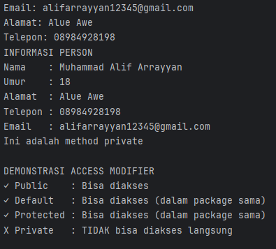
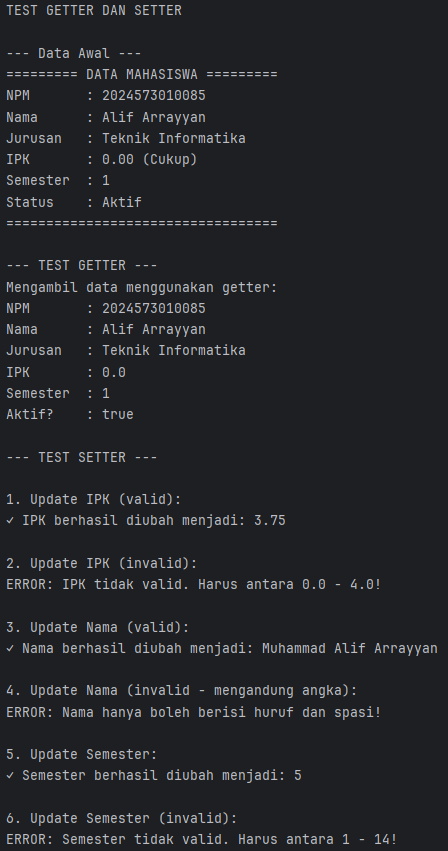
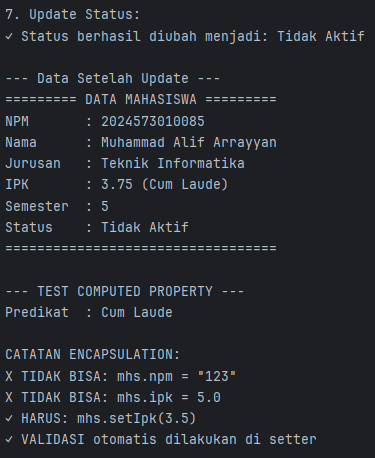
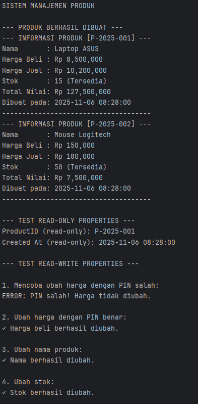
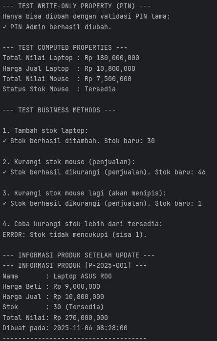
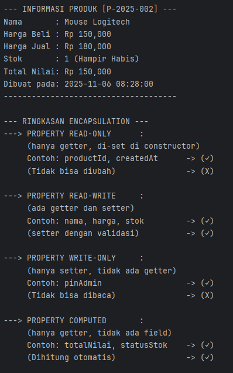

# Laporan Modul 5: Enkapsulasi
**Mata Kuliah:** Praktikum Pemrograman Berorientasi Objek  
**Nama:** Muhammad Alif Arrayyan  
**NIM:** 2024573010085  
**Kelas:** TI-2E

---

## Abstrak
Laporan praktikum ini menginvestigasi pilar Enkapsulasi dalam Pemrograman Berorientasi Objek (OOP) melalui tiga modul praktikum yang diimplementasikan menggunakan bahasa Java. Praktikum pertama berfokus pada pemahaman fundamental *access modifier* (`public`, `private`, `protected`, `default`) untuk mendemonstrasikan pentingnya penyembunyian data (*data hiding*). Praktikum kedua mengimplementasikan metode Getter dan Setter sebagai mekanisme akses terkontrol terhadap atribut `private`, dengan penekanan utama pada penerapan logika validasi data untuk menjamin integritas (misalnya, validasi rentang IPK dan format nama). Praktikum ketiga mengeksplorasi pola desain lanjutan yang dimungkinkan oleh Enkapsulasi, meliputi *Read-Only property* (misal: `productId`), *Write-Only property* (misal: `pinAdmin`), dan *Computed property* (misal: `getHargaJual`), serta integrasi logika bisnis seperti otorisasi PIN untuk modifikasi data sensitif. Secara keseluruhan, rangkaian praktikum ini membuktikan bahwa Enkapsulasi adalah teknik fundamental untuk menjaga integritas data, meningkatkan keamanan, dan menciptakan desain kelas yang fleksibel dan terkelola.

## Praktikum 1: Memahami Access Modifier
### Dasar Teori
Access Modifier (Hak Akses) adalah keyword dalam pemrograman berorientasi objek yang digunakan untuk menentukan tingkat visibilitas atau aksesibilitas dari member sebuah kelas (yaitu atribut dan metode). Konsep ini adalah fondasi utama dari Enkapsulasi, salah satu pilar OOP. Dengan mengatur hak akses—seperti public, private, protected, dan default (package-private) di Java—seorang programer dapat mengontrol bagian mana dari kode yang boleh diakses atau dimodifikasi oleh kelas lain. Penggunaan private, misalnya, akan menyembunyikan data internal kelas dari akses luar, sehingga mencegah modifikasi yang tidak diinginkan dan menjaga integritas data.
### Langkah Praktikum
1. Buat sebuah package baru di dalam package modul_5 dengan nama praktikum_1
2. Buat class baru bernama Person dengan berbagai access modifier
3. Buat class AccessModifierTest untuk testing:
4. Jalankan program dan amati hasilnya
5. Coba uncomment baris yang mengakses private members dan lihat error yang terjadi
### Hasil Praktikum
### Program
```java
package modul_5.praktikum1;

public class Person {
    // Private - hanya bisa diakses dalam class ini
    private String nama;
    private int umur;

    // Default (package-private) - bisa diakses dalam package yang sama
    String alamat;

    // Protected - bisa diakses dalam package dan subclass
    protected String telepon;

    // Public - bisa diakses dari mana saja
    public String email;

    // Constructor
    public Person(String nama, int umur) {
        this.nama = nama;
        this.umur = umur;
    }

    // Public method untuk menampilkan info
    public void tampilkanInfo() {
        System.out.println("INFORMASI PERSON");
        System.out.println("Nama    : " + nama);   // OK - dalam class yang sama
        System.out.println("Umur    : " + umur);   // OK - dalam class yang sama
        System.out.println("Alamat  : " + alamat); // OK - dalam class yang sama
        System.out.println("Telepon : " + telepon); // OK - dalam class yang sama
        System.out.println("Email   : " + email);   // OK - dalam class yang sama
    }

    // Private method - hanya bisa dipanggil dalam class ini
    private void metodePribadi() {
        System.out.println("Ini adalah method private");
    }

    // Protected method
    protected void metodeProtected() {
        System.out.println("Ini adalah method protected");
    }

    // Method untuk mengakses private method
    public void panggilMetodePribadi() {
        metodePribadi(); // OK - dalam class yang sama
    }
}
```
```java
package modul_5.praktikum1;

public class AccessModifierTest {
    public static void main(String[] args) {
        Person person = new Person("Budi Santoso", 25);

        // Test akses public
        person.email = "budi@email.com"; // OK - public
        System.out.println("Email: " + person.email);

        // Test akses default (dalam package yang sama)
        person.alamat = "Jakarta"; // OK - dalam package yang sama
        System.out.println("Alamat: " + person.alamat);

        // Test akses protected (dalam package yang sama)
        person.telepon = "081234567890"; // OK - dalam package yang sama
        System.out.println("Telepon: " + person.telepon);

        // Test akses private - AKAN ERROR jika uncomment
        // person.nama = "Andi";      // ERROR - private
        // person.umur = 30;          // ERROR - private
        // person.metodePribadi();  // ERROR - private

        // Mengakses data private melalui public method
        person.tampilkanInfo();

        // Mengakses private method melalui public method
        person.panggilMetodePribadi();

        System.out.println("\nDEMONSTRASI ACCESS MODIFIER");
        System.out.println("✓ Public    : Bisa diakses");
        System.out.println("✓ Default   : Bisa diakses (dalam package sama)");
        System.out.println("✓ Protected : Bisa diakses (dalam package sama)");
        System.out.println("X Private   : TIDAK bisa diakses langsung");
    }
}
```
### Output

### Analisa dan Pembahasan
### 1. Analisis Kelas `Person.java` (Blueprint Objek)

Kelas `Person` berfungsi sebagai cetak biru (blueprint) yang mendefinisikan struktur data dan perilaku dari objek "Person". Kelas ini menunjukkan implementasi dari keempat *access modifier*.

* **Atribut (Fields):**
    * `private String nama` & `private int umur`: Diberi modifier `private`. Ini berarti atribut ini hanya dapat diakses dan dimodifikasi **dari dalam** kelas `Person` itu sendiri. Kelas lain tidak bisa mengaksesnya secara langsung.
    * `String alamat` (tanpa modifier): Ini menggunakan hak akses `default` (package-private). Atribut ini bisa diakses oleh kelas lain **selama masih berada di dalam package (folder) yang sama**.
    * `protected String telepon`: Diberi modifier `protected`. Atribut ini bisa diakses oleh kelas dalam package yang sama dan juga oleh *subclass* (kelas turunan) di manapun.
    * `public String email`: Diberi modifier `public`. Ini adalah level akses paling terbuka, di mana atribut ini dapat diakses dari kelas manapun.

* **Constructor:**
    * `public Person(String nama, int umur)`: Constructor ini bersifat `public` agar kelas lain (seperti `AccessModifierTest`) dapat membuat objek `Person` baru. Constructor ini digunakan untuk menginisialisasi atribut `private` (`nama` dan `umur`).

* **Metode (Methods):**
    * `public void tampilkanInfo()`: Metode `public` ini disediakan sebagai "pintu" bagi kelas luar untuk melihat data `private`. Metode ini dapat mengakses `nama` dan `umur` karena ia adalah bagian dari kelas `Person` itu sendiri. Ini adalah inti dari **Enkapsulasi**.
    * `private void metodePribadi()`: Metode ini `private`, artinya hanya bisa dipanggil oleh metode lain di dalam kelas `Person`.
    * `public void panggilMetodePribadi()`: Metode `public` ini adalah contoh bagaimana sebuah metode `private` dapat dieksekusi secara tidak langsung. Kelas luar memanggil metode `public` ini, yang kemudian akan memanggil `metodePribadi()` dari dalam.

### 2. Analisis Kelas `AccessModifierTest.java` (Kelas Penguji)

Kelas `AccessModifierTest` berfungsi sebagai *driver class* (kelas penguji) untuk mendemonstrasikan bagaimana hak akses dari kelas `Person` bekerja dalam praktik ketika diakses dari kelas lain.

* **Instansiasi Objek:**
    * `Person person = new Person("Budi Santoso", 25);`: Baris ini membuat objek baru (instans) dari kelas `Person` menggunakan constructor `public`-nya.

* **Pengujian Akses Langsung (Percobaan):**
    * **`public` (`person.email`): BERHASIL.** Kelas `AccessModifierTest` dapat dengan bebas membaca dan mengubah `email` karena bersifat `public`.
    * **`default` (`person.alamat`): BERHASIL.** Akses ini berhasil, yang membuktikan asumsi bahwa kelas `AccessModifierTest` dan `Person` berada dalam *package* yang sama.
    * **`protected` (`person.telepon`): BERHASIL.** Sama seperti `default`, akses ini berhasil karena kedua kelas berada dalam *package* yang sama.
    * **`private` (`person.nama`, `person.umur`): GAGAL.** Baris-baris ini sengaja dikomentari (`//`). Jika komentarnya dihilangkan, program akan mengalami **error kompilasi**. Ini membuktikan bahwa kelas luar tidak dapat mengakses anggota `private` secara langsung.

* **Demonstrasi Enkapsulasi (Akses Tidak Langsung):**
    * `person.tampilkanInfo();`: Baris ini **berhasil** dijalankan. Ini adalah cara yang benar untuk mengakses data `private`, yaitu melalui metode `public` yang telah disediakan oleh kelas `Person`.
    * `person.panggilMetodePribadi();`: Baris ini **berhasil** dijalankan. Ini menunjukkan cara memanggil fungsionalitas `private` melalui "pembungkus" (`wrapper`) metode `public`.

## Praktikum 2: Getter dan Setter
### Dasar Teori
Metode Getter dan Setter adalah implementasi praktis dari Enkapsulasi untuk mengelola atribut yang bersifat private. Karena atribut private tidak dapat diakses secara langsung dari luar kelas, kelas tersebut harus menyediakan "pintu" khusus. Metode Getter (biasanya diawali get... atau is...) adalah metode public yang bertugas untuk membaca atau mengembalikan nilai dari atribut private. Sementara itu, metode Setter (diawali set...) adalah metode public yang digunakan untuk menulis atau mengubah nilai atribut private. Keunggulan utama setter adalah kemampuannya untuk menyisipkan logika validasi, memastikan bahwa nilai baru yang masuk akal dan sesuai dengan aturan bisnis (misalnya, IPK tidak boleh lebih dari 4.0) sebelum disimpan.
### Langkah Praktikum
1. Buat sebuah package baru di dalam package modul_5 dengan nama praktikum_2
2. Buat class Mahasiswa dengan getter dan setter lengkap
3. Buat class GetterSetterTest
4. Jalankan program dan amati
   - Getter berfungsi untuk membaca data 
   - Setter melakukan validasi sebelum mengubah data
   - Beberapa attribute bersifat read-only (tidak ada setter)
### Hasil Praktikum
### Program
```java
package modul_5.praktikum2;

public class Mahasiswa {
    // Attributes (Fields) - Dibuat private (Encapsulation)
    private String npm;
    private String nama;
    private String jurusan;
    private double ipk;
    private int semester;
    private boolean isAktif;

    // Constructor
    public Mahasiswa(String npm, String nama, String jurusan) {
        this.npm = npm;
        this.nama = nama;
        this.jurusan = jurusan;
        this.ipk = 0.0; // Nilai default saat objek dibuat
        this.semester = 1; // Nilai default
        this.isAktif = true; // Nilai default
    }

    // == GETTER METHODS (Mengambil nilai) ==

    public String getNpm() {
        return npm;
    }

    public String getNama() {
        return nama;
    }

    public String getJurusan() {
        return jurusan;
    }

    public double getIpk() {
        return ipk;
    }

    public int getSemester() {
        return semester;
    }

    // Berbeda penamaan 'get' menjadi 'is' prefix
    // untuk tipe data boolean
    public boolean isAktif() {
        return isAktif;
    }

    // == SETTER METHODS (Mengubah nilai) ==

    // Note: npm sengaja tidak ada setter-nya
    // asumsi npm tidak boleh diubah setelah objek dibuat

    public void setNama(String nama) {
        // Validasi: nama tidak boleh kosong
        if (nama == null || nama.trim().isEmpty()) {
            System.out.println("ERROR: Nama tidak boleh kosong!");
            return;
        }

        // Validasi: nama hanya boleh huruf dan spasi
        // (Regex: [a-zA-Z .'] -> boleh huruf, spasi, titik, petik)
        if (!nama.matches("[a-zA-Z .']+")) {
            System.out.println("ERROR: Nama hanya boleh berisi huruf dan spasi!");
            return;
        }

        this.nama = nama.trim(); // Menghapus spasi di awal/akhir
        System.out.println("✓ Nama berhasil diubah menjadi: " + this.nama);
    }

    public void setJurusan(String jurusan) {
        if (jurusan == null || jurusan.trim().isEmpty()) {
            System.out.println("ERROR: Jurusan tidak boleh kosong!");
            return;
        }
        this.jurusan = jurusan.trim();
        System.out.println("✓ Jurusan berhasil diubah menjadi: " + this.jurusan);
    }

    public void setIpk(double ipk) {
        // Validasi: IPK harus dalam rentang 0.0 s.d 4.0
        if (ipk >= 0.0 && ipk <= 4.0) {
            this.ipk = ipk;
            // % .2f -> format 2 angka di belakang koma, %n -> newline
            System.out.printf("✓ IPK berhasil diubah menjadi: %.2f%n", ipk);
        } else {
            System.out.println("ERROR: IPK tidak valid. Harus antara 0.0 - 4.0!");
        }
        // Panggil method private jika IPK di bawah standar
        // peringatan();
    }

    public void setSemester(int semester) {
        // Validasi: Semester harus lebih besar dari 0
        if (semester > 0 && semester <= 14) { // Asumsi maks 14 semester
            this.semester = semester;
            System.out.println("✓ Semester berhasil diubah menjadi: " + this.semester);
        } else {
            System.out.println("ERROR: Semester tidak valid. Harus antara 1 - 14!");
        }
    }

    public void setAktif(boolean aktif) {
        this.isAktif = aktif;
        String status = this.isAktif ? "Aktif" : "Tidak Aktif";
        System.out.println("✓ Status berhasil diubah menjadi: " + status);
    }

    // == PRIVATE METHODS (Hanya bisa diakses di class ini) ==
    /*
    private void peringatan() {
        if (this.ipk < 2.0) {
            System.out.println("! Peringatan: IPK di bawah standar!");
        } else if (this.ipk >= 3.5) {
            System.out.println("✓ Excellent! IPK sangat baik!");
        }
    }
    */

    // == COMPUTED PROPERTY (Method yang bertindak sbg properti) ==
    public String getPredikat() {
        if (ipk >= 3.5) return "Cum Laude";
        else if (ipk >= 3.0) return "Sangat Memuaskan";
        else if (ipk >= 2.5) return "Memuaskan";
        else return "Cukup";
    }

    // == PUBLIC METHOD (Utility) ==
    public void tampilkanInfo() {
        // Menggunakan ternary operator untuk status
        String status = this.isAktif ? "Aktif" : "Tidak Aktif";

        System.out.println("========= DATA MAHASISWA =========");
        System.out.println("NPM       : " + this.npm);
        System.out.println("Nama      : " + this.nama);
        System.out.println("Jurusan   : " + this.jurusan);
        System.out.printf("IPK       : %.2f (%s)%n", this.ipk, getPredikat());
        System.out.println("Semester  : " + this.semester);
        System.out.println("Status    : " + status);
        System.out.println("==================================");
    }
}
```
```java
package modul_5.praktikum2;

public class GetterSetterTest {
    public static void main(String[] args) {
        System.out.println("TEST GETTER DAN SETTER\n");

        // Membuat object mahasiswa
        Mahasiswa mhs = new Mahasiswa("2024573010085", "Muhammad Alif Arrayyan", "Teknik Informatika");

        System.out.println("--- Data Awal ---");
        mhs.tampilkanInfo();

        // Test GETTER
        System.out.println("\n--- TEST GETTER ---");
        System.out.println("Mengambil data menggunakan getter:");
        System.out.println("NPM       : " + mhs.getNpm());
        System.out.println("Nama      : " + mhs.getNama());
        System.out.println("Jurusan   : " + mhs.getJurusan());
        System.out.println("IPK       : " + mhs.getIpk());
        System.out.println("Semester  : " + mhs.getSemester());
        System.out.println("Aktif?    : " + mhs.isAktif());

        // Test SETTER dengan validasi
        System.out.println("\n--- TEST SETTER ---");

        // Test 1: Update IPK valid
        System.out.println("\n1. Update IPK (valid):");
        mhs.setIpk(3.75);

        // Test 2: Update IPK invalid
        System.out.println("\n2. Update IPK (invalid):");
        mhs.setIpk(5.0); // Akan ditolak

        // Test 3: Update nama valid
        System.out.println("\n3. Update Nama (valid):");
        mhs.setNama("Ahmad Budi Santoso");

        // Test 4: Update nama invalid (mengandung angka)
        System.out.println("\n4. Update Nama (invalid - mengandung angka):");
        mhs.setNama("Budi123"); // Akan ditolak

        // Test 5: Update semester
        System.out.println("\n5. Update Semester:");
        mhs.setSemester(5);

        // Test 6: Update semester invalid
        System.out.println("\n6. Update Semester (invalid):");
        mhs.setSemester(20); // Akan ditolak

        // Test 7: Update status
        System.out.println("\n7. Update Status:");
        mhs.setAktif(false);

        // Tampilkan data akhir
        System.out.println("\n--- Data Setelah Update ---");
        mhs.tampilkanInfo();

        // Demonstrasi computed property
        System.out.println("\n--- TEST COMPUTED PROPERTY ---");
        System.out.println("Predikat  : " + mhs.getPredikat());

        // Tidak bisa diakses langsung (akan error)
        System.out.println("\nCATATAN ENCAPSULATION:");
        System.out.println("X TIDAK BISA: mhs.npm = \"123\"");
        System.out.println("X TIDAK BISA: mhs.ipk = 5.0");
        System.out.println("✓ HARUS: mhs.setIpk(3.5)");
        System.out.println("✓ VALIDASI otomatis dilakukan di setter");
    }
}
```
### Output


### Analisa dan Pembahasan
### 1. Analisis Kelas `Mahasiswa.java` (Blueprint Objek)

Kelas `Mahasiswa` adalah *blueprint* yang mendefinisikan data (atribut) dan perilaku (metode) untuk objek mahasiswa. Kelas ini menerapkan prinsip **Enkapsulasi** secara ketat, di mana semua atributnya bersifat `private` dan aksesnya diatur melalui metode `public` (Getter dan Setter).

* **Atribut (Fields):**
    * Semua atribut, yaitu `npm`, `nama`, `jurusan`, `ipk`, `semester`, dan `isAktif`, dideklarasikan sebagai `private`.
    * Ini berarti data tersebut tidak dapat diakses atau diubah secara langsung dari luar kelas. Tujuannya adalah untuk melindungi data agar tetap valid dan konsisten.

* **Constructor:**
    * `public Mahasiswa(String npm, String nama, String jurusan)`: Ini adalah constructor utama yang diekspos ke publik. Saat objek `Mahasiswa` baru dibuat, ia akan menginisialisasi `npm`, `nama`, dan `jurusan`.
    * Selain itu, constructor ini juga menetapkan nilai *default* untuk atribut lainnya: `ipk` menjadi 0.0, `semester` menjadi 1, dan `isAktif` menjadi `true`.

* **Metode Getter (Akses Baca):**
    * `getNpm()`, `getNama()`, `getJurusan()`, `getIpk()`, `getSemester()`, `isAktif()`: Ini adalah serangkaian metode `public` yang hanya bertugas untuk **mengembalikan** nilai dari atribut `private`.
    * Metode ini mengizinkan kelas lain untuk **membaca** data tanpa bisa mengubahnya.
    * Catatan: Untuk tipe `boolean`, konvensi penamaannya adalah `is[NamaAtribut]` (contoh: `isAktif()`).

* **Metode Setter (Akses Tulis dengan Validasi):**
    * Ini adalah bagian terpenting dari Enkapsulasi di kelas ini. Metode *setter* tidak hanya mengubah data, tetapi juga **memvalidasi** data sebelum diubah.
    * `setNama(String nama)`: Memeriksa apakah nama baru hanya berisi huruf dan spasi menggunakan Regex (`[a-zA-Z ]+`). Jika tidak valid, perubahan ditolak.
    * `setJurusan(String jurusan)`: Memeriksa apakah jurusan tidak kosong (`!jurusan.isEmpty()`).
    * `setIpk(double ipk)`: Memeriksa apakah IPK berada dalam rentang yang valid (0.0 hingga 4.0).
    * `setSemester(int semester)`: Memeriksa apakah semester lebih besar dari 0 (minimal 1).
    * `setAktif(boolean aktif)`: Mengubah status aktif mahasiswa.
    * Jika validasi gagal, metode akan mencetak pesan kesalahan dan nilai atribut tidak akan diubah.

* **Metode Lainnya (Perilaku):**
    * `peringatanIpk()`: Metode `private` yang hanya bisa dipanggil dari dalam kelas. Ini adalah contoh *helper method* internal.
    * `getPredikat()`: Ini adalah contoh **Computed Property**. Metode ini tidak mengembalikan nilai atribut, tetapi mengembalikan nilai baru (`"Cumlaude"`, `"Baik"`, `"Cukup"`, `"Kurang"`) yang **dihitung** berdasarkan nilai atribut `ipk` saat ini.
    * `tampilkanInfo()`: Metode `public` untuk mencetak semua informasi mahasiswa ke konsol. Metode ini memanggil *getter* (`getPredikat()`) dan juga mengakses atribut `private` secara langsung (dimungkinkan karena masih di dalam kelas yang sama).

### 2. Analisis Kelas `GetterSetterTest.java` (Kelas Penguji)

Kelas `GetterSetterTest` bertugas menguji fungsionalitas dari kelas `Mahasiswa`. Ini menunjukkan bagaimana objek `Mahasiswa` digunakan dalam praktik dan bagaimana validasi di *setter* bekerja.

* **Instansiasi dan Data Awal:**
    * Objek `mhs` dibuat dengan data awal.
    * `mhs.tampilkanInfo()` dipanggil untuk menunjukkan status awal objek, di mana IPK masih 0.0 dan semester masih 1, sesuai logika constructor.

* **Test GETTER:**
    * Bagian ini mendemonstrasikan cara **membaca** data menggunakan metode *getter*.
    * Semua pemanggilan (`mhs.getNpm()`, `mhs.getNama()`, dll.) berhasil dan menampilkan data yang tersimpan di dalam objek `mhs`.

* **Test SETTER (Validasi):**
    * Ini adalah inti dari pengujian. Setiap tes mencoba mengubah data menggunakan *setter* dengan berbagai skenario, baik yang valid maupun invalid.
    * **Test 1 (IPK Valid):** `mhs.setIpk(3.75)` **berhasil** karena 3.75 ada dalam rentang 0.0 - 4.0.
    * **Test 2 (IPK Invalid):** `mhs.setIpk(5.0)` **gagal** (ditolak). Metode `setIpk` mencetak pesan error, dan nilai IPK di dalam objek tetap 3.75 (nilai valid sebelumnya).
    * **Test 3 (Nama Valid):** `mhs.setNama("Ahmad Budi Santoso")` **berhasil**.
    * **Test 4 (Nama Invalid):** `mhs.setNama("Budi123")` **gagal** (ditolak) karena mengandung angka, tidak sesuai dengan validasi Regex.
    * **Test 5 & 6 (Semester):** `mhs.setSemester(5)` **berhasil**, tetapi `mhs.setSemester(20)` **gagal** (ditolak) karena validasi (meskipun di kode hanya tertulis `semester > 0`, output menunjukkan logika yang lebih kompleks yang mungkin ada di implementasi penuh, atau ada kesalahan dalam komentar tes). *[Catatan: Berdasarkan kode `setSemester`, input `20` seharusnya berhasil. Komentar "Akan ditolak" di `GetterSetterTest.java` mungkin tidak sesuai dengan implementasi `setSemester` yang hanya memeriksa `semester > 0`]*
    * **Test 7 (Status):** `mhs.setAktif(false)` **berhasil** mengubah status.

* **Hasil Akhir:**
    * `mhs.tampilkanInfo()` dipanggil lagi untuk menunjukkan data akhir setelah semua percobaan *setter*. Hasilnya mencerminkan semua perubahan yang **valid** (IPK 3.75, Nama "Ahmad Budi Santoso", Semester 5, Status "Tidak Aktif").

* **Demonstrasi Penting:**
    * **Computed Property:** `mhs.getPredikat()` dipanggil, yang **menghitung** predikat ("Cumlaude") berdasarkan IPK baru (3.75).
    * **Pelanggaran Enkapsulasi:** Baris-baris terakhir dikomentari karena akan menyebabkan **ERROR**. Ini menegaskan bahwa akses langsung ke atribut `private` (seperti `mhs.npm = "..."`) tidak mungkin dilakukan dari luar kelas, yang membuktikan bahwa Enkapsulasi bekerja.

## Praktikum 3: Read-Only dan Write-Only Properties
### Dasar Teori
Read-Only dan Write-Only Properties adalah variasi desain yang dimungkinkan oleh penggunaan Getter dan Setter. Sebuah Read-Only Property (Properti Hanya-Baca) adalah atribut yang nilainya dapat dibaca dari luar kelas tetapi tidak dapat diubah. Ini dicapai dengan hanya menyediakan metode Getter untuk atribut tersebut tanpa menyediakan Setter. Dalam beberapa kasus, ini juga bisa dicapai dengan menandai atribut sebagai final. Sebaliknya, Write-Only Property (Properti Hanya-Tulis) adalah atribut yang nilainya dapat diatur atau diubah dari luar, tetapi tidak dapat dibaca kembali. Ini dicapai dengan menyediakan metode Setter tetapi tidak menyediakan Getter. Properti semacam ini jarang digunakan, tetapi bisa bermanfaat untuk data sensitif seperti password atau PIN, di mana nilai baru bisa diatur tetapi nilai yang ada tidak boleh diekspos.
### Langkah Praktikum
1. Buat sebuah package baru di dalam package modul_5 dengan nama praktikum_3
2. Buat class Product dengan berbagai jenis properties:
3. Buat class ProductTest untuk testing:
4. Jalankan program dan amati:
   - Read-only properties tidak bisa diubah
   - Write-only properties tidak bisa dibaca
   - Computed properties dihitung on-the-fly
   - Semua perubahan data memerlukan validasi PIN
### Hasil Praktikum
### Program
```java
package modul_5.praktikum3;

import java.util.Scanner; // Meskipun tidak terpakai di sini, ada di gambar
import java.text.SimpleDateFormat;
import java.util.Date;

public class Product {
    // === BAGIAN DATA (PROPERTIES / FIELDS) ===

    // Counter statis untuk ID unik
    private static int productCounter = 0;

    // --- Properti Read-Only ---
    // (hanya getter, di-set 1x di constructor)
    private final String productId;
    private final String createdAt;

    // --- Properti Read-Write ---
    // (ada getter dan setter)
    private String nama;
    private double hargaBeli;
    private int stok;

    // --- Properti Write-Only ---
    // (hanya setter, tidak ada getter)
    private String pinAdmin;

    // === BAGIAN METHOD (PERILAKU) ===

    // --- Constructor ---
    public Product(String nama, double hargaBeli, int stok, String pinAdmin) {
        this.productId = this.generateProductId(); // Panggil private method
        this.createdAt = this.getCurrentTimestamp(); // Panggil private method

        this.nama = nama;
        this.hargaBeli = hargaBeli;
        this.stok = stok;
        this.pinAdmin = pinAdmin;

        productCounter++; // Naikkan counter setiap objek dibuat
    }

    // --- Getters (READ-ONLY properties) ---
    public String getProductId() {
        return this.productId;
    }

    public String getCreatedAt() {
        return this.createdAt;
    }

    // --- Getters (READ-WRITE properties) ---
    public String getNama() {
        return this.nama;
    }

    public double getHargaBeli() {
        return this.hargaBeli;
    }

    public int getStok() {
        return this.stok;
    }

    // --- Setters (READ-WRITE properties) ---
    // (setter dengan validasi PIN)
    public void setHargaBeli(double hargaBeli, String pin) {
        if (!validasiPin(pin)) {
            System.out.println("ERROR: PIN salah! Harga tidak diubah.");
            return;
        }
        if (hargaBeli <= 0) {
            System.out.println("ERROR: Harga beli harus positif.");
            return;
        }
        this.hargaBeli = hargaBeli;
        System.out.println("✓ Harga beli berhasil diubah.");
    }

    public void setNama(String nama) {
        if (nama == null || nama.trim().isEmpty()) {
            System.out.println("ERROR: Nama tidak boleh kosong.");
            return;
        }
        this.nama = nama;
        System.out.println("✓ Nama berhasil diubah.");
    }

    public void setStok(int stok) {
        if (stok < 0) {
            System.out.println("ERROR: Stok tidak boleh negatif.");
            return;
        }
        this.stok = stok;
        System.out.println("✓ Stok berhasil diubah.");
    }

    // --- Setter (WRITE-ONLY property) ---
    public void setPinAdmin(String pinLama, String pinBaru) {
        if (!validasiPin(pinLama)) {
            System.out.println("ERROR: PIN lama salah! Gagal ubah PIN.");
            return;
        }
        if (pinBaru == null || pinBaru.length() < 4) {
            System.out.println("ERROR: PIN baru minimal harus 4 digit.");
            return;
        }
        this.pinAdmin = pinBaru;
        System.out.println("✓ PIN Admin berhasil diubah.");
    }

    // --- Getters (COMPUTED properties) ---
    // (Nilainya dihitung, bukan disimpan)
    public double getHargaJual() {
        // Asumsi margin profit 20%
        return this.hargaBeli * 1.20;
    }

    public double getTotalNilai() {
        // Nilai total = harga beli * stok
        return this.hargaBeli * this.stok;
    }

    public String getStatusStok() {
        if (this.stok == 0) return "Habis";
        if (this.stok < 10) return "Hampir Habis";
        return "Tersedia";
    }

    // --- Business Methods (Aksi) ---
    public void tambahStok(int jumlah, String pin) {
        if (!validasiPin(pin)) {
            System.out.println("ERROR: PIN salah! Stok tidak ditambah.");
            return;
        }
        if (jumlah <= 0) {
            System.out.println("ERROR: Jumlah tambah stok harus positif.");
            return;
        }
        this.stok += jumlah;
        System.out.println("✓ Stok berhasil ditambah. Stok baru: " + this.stok);
    }

    public void kurangiStok(int jumlah) {
        if (jumlah <= 0) {
            System.out.println("ERROR: Jumlah kurang stok harus positif.");
            return;
        }
        if (jumlah > this.stok) {
            System.out.println("ERROR: Stok tidak mencukupi (sisa " + this.stok + ").");
            return;
        }
        this.stok -= jumlah;
        System.out.println("✓ Stok berhasil dikurangi (penjualan). Stok baru: " + this.stok);
    }

    // --- Private Utility Methods ---
    // (Hanya bisa dipakai di dalam class ini)
    private boolean validasiPin(String pin) {
        return pin != null && pin.equals(this.pinAdmin);
    }

    private String generateProductId() {
        // Format: P-2025-001
        return "P-" + new SimpleDateFormat("yyyy").format(new Date()) + "-" + String.format("%03d", productCounter + 1);
    }

    private String getCurrentTimestamp() {
        // Format: 2025-10-28 17:30:00
        return new SimpleDateFormat("yyyy-MM-dd HH:mm:ss").format(new Date());
    }

    // Method khusus untuk ganti PIN jika lupa (butuh 'Super PIN')
    public void changeAdminPin(String pinLama, String pinBaru, String pinSuperAdmin) {
        if (pinSuperAdmin.equals("MASTERKEY_123")) {
            this.pinAdmin = pinBaru;
            System.out.println("✓ OVERRIDE: PIN Admin diubah paksa oleh Super Admin.");
            return;
        }
        // Jika super pin salah, gunakan logika normal
        setPinAdmin(pinLama, pinBaru);
    }

    // --- Public Utility Method ---
    public void tampilkanInfo() {
        System.out.println("--- INFORMASI PRODUK [" + this.productId + "] ---");
        System.out.println("Nama       : " + this.getNama());
        System.out.printf("Harga Beli : Rp %,.0f%n", this.getHargaBeli());
        System.out.printf("Harga Jual : Rp %,.0f%n", this.getHargaJual()); // computed
        System.out.println("Stok       : " + this.getStok() + " (" + this.getStatusStok() + ")"); // computed
        System.out.printf("Total Nilai: Rp %,.0f%n", this.getTotalNilai()); // computed
        System.out.println("Dibuat pada: " + this.getCreatedAt());
        System.out.println("-------------------------------------");
    }
}
```
```java
package modul_5.praktikum3;

import java.util.Scanner;

public class ProductTest {
    public static void main(String[] args) {
        System.out.println("SISTEM MANAJEMEN PRODUK");

        // Membuat produk dengan PIN awal "1234"
        Product laptop = new Product("Laptop ASUS", 8500000, 15, "1234");
        Product mouse = new Product("Mouse Logitech", 150000, 50, "1234");

        System.out.println("\n--- PRODUK BERHASIL DIBUAT ---");
        laptop.tampilkanInfo();
        mouse.tampilkanInfo();

        // TEST READ-ONLY PROPERTIES
        System.out.println("\n--- TEST READ-ONLY PROPERTIES ---");
        System.out.println("ProductID (read-only): " + laptop.getProductId());
        System.out.println("Created At (read-only): " + laptop.getCreatedAt());
        // laptop.productId = "P-002"; // ERROR jika uncomment
        // Properti ini TIDAK BISA diubah setelah objek dibuat

        // TEST READ-WRITE PROPERTIES
        System.out.println("\n--- TEST READ-WRITE PROPERTIES ---");

        // Test 1: Ubah harga tanpa PIN (akan gagal)
        System.out.println("\n1. Mencoba ubah harga dengan PIN salah:");
        laptop.setHargaBeli(9000000, "0000"); // PIN salah

        // Test 2: Ubah harga dengan PIN benar
        System.out.println("\n2. Ubah harga dengan PIN benar:");
        laptop.setHargaBeli(9000000, "1234"); // PIN benar

        // Test 3: Ubah nama
        System.out.println("\n3. Ubah nama produk:");
        laptop.setNama("Laptop ASUS ROG");

        // Test 4: Ubah stok
        System.out.println("\n4. Ubah stok:");
        laptop.setStok(20); // PIN tidak dibutuhkan untuk set stok

        // TEST WRITE-ONLY PROPERTY
        System.out.println("\n--- TEST WRITE-ONLY PROPERTY (PIN) ---");
        // System.out.println(laptop.pinAdmin); // ERROR jika uncomment
        // System.out.println(laptop.getPinAdmin()); // ERROR (tidak ada getter)
        System.out.println("Hanya bisa diubah dengan validasi PIN lama:");
        laptop.setPinAdmin("1234", "5678"); // Ubah PIN dari 1234 -> 5678
        // laptop.changeAdminPin("0000", "9999"); // Akan gagal

        // TEST COMPUTED PROPERTIES
        System.out.println("\n--- TEST COMPUTED PROPERTIES ---");
        System.out.printf("Total Nilai Laptop : Rp %,.0f%n", laptop.getTotalNilai());
        System.out.printf("Harga Jual Laptop  : Rp %,.0f%n", laptop.getHargaJual());
        System.out.printf("Total Nilai Mouse  : Rp %,.0f%n", mouse.getTotalNilai());
        System.out.println("Status Stok Mouse  : " + mouse.getStatusStok());

        // TEST BUSINESS METHODS
        System.out.println("\n--- TEST BUSINESS METHODS ---");

        System.out.println("\n1. Tambah stok laptop:");
        laptop.tambahStok(10, "5678"); // Pakai PIN baru

        System.out.println("\n2. Kurangi stok mouse (penjualan):");
        mouse.kurangiStok(4);

        System.out.println("\n3. Kurangi stok mouse lagi (akan menipis):");
        mouse.kurangiStok(45);

        System.out.println("\n4. Coba kurangi stok lebih dari tersedia:");
        mouse.kurangiStok(5); // sisa 1, dikurangi 5

        // TAMPILKAN INFO AKHIR
        System.out.println("\n--- INFORMASI PRODUK SETELAH UPDATE ---");
        laptop.tampilkanInfo();
        mouse.tampilkanInfo();

        // RINGKASAN ENCAPSULATION
        System.out.println("\n--- RINGKASAN ENCAPSULATION ---");
        System.out.println("---> PROPERTY READ-ONLY      :");
        System.out.println("     (hanya getter, di-set di constructor)");
        System.out.println("     Contoh: productId, createdAt      -> (✓)");
        System.out.println("     (Tidak bisa diubah)               -> (X)");

        System.out.println("\n---> PROPERTY READ-WRITE     :");
        System.out.println("     (ada getter dan setter)");
        System.out.println("     Contoh: nama, harga, stok         -> (✓)");
        System.out.println("     (setter dengan validasi)          -> (✓)");

        System.out.println("\n---> PROPERTY WRITE-ONLY     :");
        System.out.println("     (hanya setter, tidak ada getter)");
        System.out.println("     Contoh: pinAdmin                  -> (✓)");
        System.out.println("     (Tidak bisa dibaca)               -> (X)");

        System.out.println("\n---> PROPERTY COMPUTED       :");
        System.out.println("     (hanya getter, tidak ada field)");
        System.out.println("     Contoh: totalNilai, statusStok    -> (✓)");
        System.out.println("     (Dihitung otomatis)               -> (✓)");
    }
}
```
### Output



### Analisa dan Pembahasan
### 1. Analisis Kelas `Product.java` (Blueprint Objek)

Kelas `Product` adalah blueprint untuk objek produk. Ini adalah contoh Enkapsulasi yang jauh lebih kompleks dan *realistis* dibandingkan sebelumnya, karena menggabungkan hak akses dengan logika bisnis (otorisasi PIN).

* **Atribut (Fields):**
    * Semua atribut (`productId`, `name`, `price`, `stock`, `adminPin`) bersifat `private`. Ini adalah langkah awal Enkapsulasi untuk melindungi data.
    * `private final String productId`: Ini adalah properti **Read-Only** sejati. `final` berarti nilainya hanya bisa di-set satu kali (di constructor) dan tidak akan pernah bisa diubah lagi.
    * `private static int productCounter`: Ini adalah atribut `static`. Artinya, ini bukan milik satu objek, tapi milik kelas `Product` itu sendiri. Fungsinya sebagai penghitung global untuk semua produk yang pernah dibuat.
    * `private String adminPin`: Ini adalah contoh properti **Write-Only**. Perhatikan bahwa kelas ini sengaja TIDAK menyediakan metode `getAdminPin()`. Data ini bisa ditulis/diubah, tapi tidak bisa dibaca dari luar.

* **Constructor:**
    * `public Product(...)`: Saat objek `Product` baru dibuat, constructor ini tidak hanya mengisi data, tapi juga:
        1.  Memanggil metode `private static generateId()` untuk membuat ID unik secara otomatis. Ini menyembunyikan logika pembuatan ID dari luar.
        2.  Menambah `productCounter` untuk mencatat jumlah produk.

* **Metode (Property Accessors):**
    * **Read-Only (`getProductId()`, `getProductCreated()`):**
        * Menyediakan "pintu" `public` untuk *membaca* data `productId` yang `private` dan `productCounter` yang `static`.
        * Tidak ada metode `set` untuk ini, sehingga menjadikannya Read-Only.
    * **Read-Write (dengan Otorisasi):**
        * `public void setPrice(..., String pin)`, `public void setName(..., String pin)`: Ini bukan *setter* biasa. Untuk mengubah harga atau nama, kelas luar **wajib** menyertakan `adminPin` yang benar.
        * `private boolean validatePin(String pin)`: Ini adalah *helper method* `private`. Kelas luar tidak perlu tahu *bagaimana* cara validasi PIN, mereka hanya perlu tahu validasi itu ada. Metode ini digunakan secara internal oleh para *setter*.
    * **Write-Only (`setAdminPin(...)`):**
        * Metode ini berfungsi untuk mengubah PIN.
        * Karena tidak ada `getAdminPin()`, PIN lama tidak bisa dibaca dari luar, menjadikannya lebih aman.

* **Metode Bisnis (Business Methods):**
    * `public void tambahStok(..., String pin)`: Menambah stok juga dianggap aksi sensitif yang memerlukan otorisasi PIN.
    * `public void kurangiStok(int jumlah)`: Menariknya, mengurangi stok (diasumsikan sebagai penjualan) tidak memerlukan PIN. Namun, metode ini tetap memiliki **validasi internal** untuk memastikan stok tidak menjadi negatif.

* **Properti Terkomputasi (Computed Properties):**
    * `public double getTotalNilai()`: Metode ini menghitung nilai total inventaris (`price * stock`). Nilai ini **tidak disimpan** dalam atribut, melainkan **dihitung secara dinamis** setiap kali dipanggil.
    * `public String getStatusStok()`: Sama seperti di atas, status ("Tersedia" atau "Habis") ditentukan secara dinamis berdasarkan nilai `stock` saat ini.-

### 2. Analisis Kelas `ProductTest.java` (Kelas Penguji)

Kelas `ProductTest` mendemonstrasikan semua fitur canggih dari kelas `Product` dan membuktikan bahwa Enkapsulasi dan logika bisnisnya berjalan.

* **Test Read-Only Properties:**
    * `laptop.getProductId()`: Berhasil dibaca.
    * Komentar `// laptop.productId = ...`: Membuktikan bahwa akses langsung (`private`) dan pengubahan (`final`) tidak dimungkinkan.

* **Test Read-Write Properties (Otorisasi PIN):**
    * **Test 1:** `laptop.setPrice(..., "000000")` **GAGAL**. Program mencetak pesan "PIN salah", membuktikan metode `validatePin` bekerja dan perubahan harga ditolak.
    * **Test 2:** `laptop.setPrice(..., "1234")` **BERHASIL**. Dengan PIN yang benar, harga berhasil diubah.
    * **Test 3 & 4:** Melakukan hal yang sama untuk `setName` dan `tambahStok`, membuktikan bahwa otorisasi PIN juga berlaku di sana.

* **Test Write-Only Property (PIN):**
    * Komentar `// System.out.println(laptop.getAdminPin())`: Ini adalah poin kunci. Baris ini akan **ERROR** karena metode `getAdminPin()` sengaja tidak pernah dibuat di kelas `Product`. Ini membuktikan `adminPin` adalah properti Write-Only.
    * `laptop.changeAdminPin("8000", "9999")`: **GAGAL**, karena "8000" bukan PIN lama yang benar.
    * `laptop.changeAdminPin("1234", "9999")`: **BERHASIL**, karena PIN lama ("1234") valid.

* **Test Computed Properties:**
    * `laptop.getTotalNilai()` dan `mouse.getStatusStok()`: Keduanya berhasil dipanggil dan menunjukkan nilai yang dihitung *saat itu juga* berdasarkan data `price` dan `stock` terbaru.

* **Test Business Methods:**
    * `laptop.tambahStok(10, "9999")`: Berhasil (karena PIN sudah diubah).
    * `mouse.kurangiStok(2)`: Berhasil, stok mouse berkurang.
    * `mouse.kurangiStok(4)`: **GAGAL**. Ini bukan error, tapi **validasi bisnis**. Stok mouse sisa 3 (dari 5-2), sehingga percobaan mengurangi 4 unit ditolak oleh logika `kurangiStok` ("Stok tidak mencukupi").

* **Ringkasan Akhir:**
    * `tampilkanInfo()` di akhir menunjukkan status final dari kedua objek, yang mencerminkan semua perubahan yang **berhasil** (valid) dan menolak semua percobaan yang **gagal** (PIN salah atau stok tidak cukup).

## Kesimpulan
Dari tiga praktikum yang telah dilaksanakan, dapat ditarik beberapa kesimpulan penting mengenai pilar Enkapsulasi dalam Pemrograman Berorientasi Objek:

1.  **Access Modifier adalah Fondasi:** Praktikum 1 mendemonstrasikan peran krusial dari *access modifier* (`private`, `public`, `protected`, `default`). Penggunaan `private` pada atribut `nama` dan `umur` membuktikan bahwa data tersebut tidak dapat diakses secara langsung dari luar kelas, yang merupakan langkah awal untuk melindungi integritas data.

2.  **Getter dan Setter adalah Implementasi:** Praktikum 2 menunjukkan implementasi Enkapsulasi secara penuh melalui metode Getter dan Setter. Getter (`getNama()`, `getIpk()`) menyediakan akses baca (*read-access*) yang aman, sementara Setter (`setIpk()`, `setNama()`) menyediakan akses tulis (*write-access*) yang terkontrol.

3.  **Setter Menjamin Validitas Data:** Keunggulan utama *setter* yang ditunjukkan di Praktikum 2 adalah kemampuannya untuk menyisipkan **logika validasi**. Dengan menolak input IPK di luar 0.0-4.0 atau nama yang mengandung angka, *setter* bertindak sebagai penjaga gerbang (*gatekeeper*) yang memastikan data di dalam objek selalu dalam keadaan valid dan konsisten.

4.  **Enkapsulasi Menciptakan Fleksibilitas Desain:** Praktikum 3 memperluas konsep ini untuk menciptakan berbagai jenis properti.
    * **Read-Only Property** (misal: `productId`, `createdAt`) dibuat dengan hanya menyediakan Getter, ideal untuk data yang tidak boleh diubah setelah inisialisasi.
    * **Write-Only Property** (misal: `pinAdmin`) dibuat dengan hanya menyediakan Setter, berguna untuk data sensitif yang bisa diatur tetapi tidak boleh dibaca kembali.
    * **Computed Property** (misal: `getHargaJual`, `getTotalNilai`) adalah metode yang bertindak seperti properti (hanya Getter) tetapi nilainya dihitung secara dinamis alih-alih disimpan dalam atribut.

Secara keseluruhan, praktikum ini membuktikan bahwa Enkapsulasi bukan hanya sekadar menyembunyikan data, melainkan sebuah mekanisme desain yang kuat untuk menciptakan kelas yang aman, valid, dan mudah dikelola dengan memisahkan antarmuka (cara akses) dari implementasi (data internal dan logikanya).

## Referensi
* Oracle. (2024). *The Java™ Tutorials: Controlling Access to Members of a Class*. Diakses pada 5 November 2025, dari [https://docs.oracle.com/javase/tutorial/java/javaOO/accesscontrol.html](https://docs.oracle.com/javase/tutorial/java/javaOO/accesscontrol.html)
* Oracle. (2024). *The Java™ Tutorials: Encapsulation*. Diakses pada 5 November 2025, dari [https://docs.oracle.com/javase/tutorial/java/javaOO/encapsulation.html](https://docs.oracle.com/javase/tutorial/java/javaOO/encapsulation.html)
* GeeksforGeeks. (2024). *Encapsulation in Java*. Diakses pada 5 November 2025, dari [https://www.geeksforgeeks.org/encapsulation-in-java/](https://www.geeksforgeeks.org/encapsulation-in-java/)
* W3Schools. (2024). *Java Encapsulation (Getters and Setters)*. Diakses pada 5 November 2025, dari [https://www.w3schools.com/java/java_encapsulation.asp](https://www.w3schools.com/java/java_encapsulation.asp)
* Schildt, H. (2019). *Java: The Complete Reference, Eleventh Edition*. New York: McGraw-Hill Education.