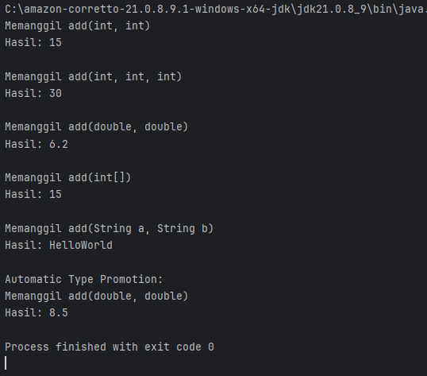
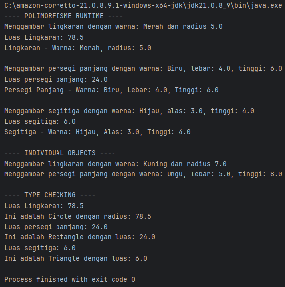

# Laporan Modul 7: Polymorphism
**Mata Kuliah:** Praktikum Pemrograman Berorientasi Objek  
**Nama:** Muhammad Alif Arrayyan  
**NIM:** 2024573010085  
**Kelas:** TI-2E

---
    
## Abstrak
Polimorfisme merupakan salah satu pilar utama dalam Pemrograman Berorientasi Objek (PBO) yang memungkinkan sebuah antarmuka tunggal untuk merepresentasikan entitas yang berbeda. Laporan praktikum ini membahas implementasi dua jenis polimorfisme dalam bahasa pemrograman Java, yaitu Compile-time Polymorphism melalui Method Overloading dan Runtime Polymorphism melalui Method Overriding. Pada percobaan pertama, dilakukan simulasi kalkulator untuk menguji mekanisme pemilihan method berdasarkan variasi parameter (tipe data dan jumlah argumen). Percobaan kedua berfokus pada hierarki kelas geometri (Shape, Circle, Rectangle, Triangle) untuk mendemonstrasikan Dynamic Binding, di mana pemilihan method yang dieksekusi ditentukan pada saat runtime berdasarkan tipe objek yang sebenarnya. Praktikum ini juga menerapkan penggunaan operator instanceof untuk validasi tipe sebelum melakukan downcasting. Hasil pengujian menunjukkan bahwa Java berhasil menangani fleksibilitas method melalui mekanisme static binding untuk overloading dan dynamic binding untuk overriding, yang berkontribusi pada penulisan kode yang lebih modular, mudah dibaca, dan reusable.

## Praktikum 1: Memahami Method Overloading (Compile-time Polymorphism)
### Dasar Teori
**1. Pengertian Method Overloading**
Method Overloading adalah penerapan dari konsep *Compile-time Polymorphism* (Polimorfisme Statis) dalam pemrograman berorientasi objek. Konsep ini memungkinkan sebuah class memiliki lebih dari satu method dengan **nama yang sama**, namun dengan **tanda tangan (signature) yang berbeda**.

**2. Syarat Overloading**
Agar method dapat dikatakan overloading, harus terdapat perbedaan pada parameter yang diterima, yaitu:
* **Jumlah Parameter:** Misalnya method `add(int a)` berbeda dengan `add(int a, int b)`.
* **Tipe Data Parameter:** Misalnya method `add(int a)` berbeda dengan `add(double a)`.
* **Urutan Tipe Data:** Misalnya `method(int a, double b)` berbeda dengan `method(double a, int b)`.

**Catatan:** Perbedaan hanya pada *return type* (tipe kembalian) tidak dianggap sebagai overloading dan akan menyebabkan error kompilasi jika parameternya sama persis.

**3. Automatic Type Promotion**
Java memiliki mekanisme *Automatic Type Promotion*. Jika method dipanggil dengan argumen yang tipe datanya lebih kecil (misalnya `int`) dan tidak ditemukan method yang persis menerima `int`, maka Java akan mempromosikan tipe data tersebut ke tipe yang lebih besar (misalnya `double`) untuk menemukan method yang cocok.
### Langkah Praktikum
1. Buat sebuah package baru di dalam package modul_7 dengan nama praktikum_1
2. Buat class Calculator dengan method overloading:
3. Buat class OverloadingTest untuk testing:\
4. Jalankan program dan amati hasilnya
5. Perhatikan bagaimana compiler memilih method yang tepat berdasarkan parameter
### Hasil Praktikum
### Program
```java
package modul_7.praktikum_1;

public class Calculator {
    public int add(int a, int b) {
        System.out.println("Memanggil add(int, int)");
        return a + b;
    }

    public int add(int a, int b, int c) {
        System.out.println("Memanggil add(int, int, int)");
        return a + b + c;
    }

    public double add(double a, double b) {
        System.out.println("Memanggil add(double, double)");
        return a + b;
    }

    public int add(int[] numbers) {
        System.out.println("Memanggil add(int[])");
        int sum = 0;
        for (int num : numbers) {
            sum += num;
        }
        return sum;
    }

    public String add(String a, String b) {
        System.out.println("Memanggil add(String a, String b)");
        return a + b;
    }
}
```
```java
package modul_7.praktikum_1;

public class OverLoadingTest {
    public static void main(String[] args) {
        Calculator calc = new Calculator();

        System.out.println("Hasil: " + calc.add(5, 10));
        System.out.println();

        System.out.println("Hasil: " + calc.add(5, 10, 15));
        System.out.println();

        System.out.println("Hasil: " + calc.add(3.5, 2.7));
        System.out.println();

        int[] numbers = {1, 2, 3, 4, 5};
        System.out.println("Hasil: " + calc.add(numbers));
        System.out.println();

        System.out.println("Hasil: " + calc.add("Hello", "World"));
        System.out.println();

        System.out.println("Automatic Type Promotion: ");
        System.out.println("Hasil: " + calc.add(5, 3.5));
    }
}
```
### Output

### Analisa dan Pembahasan
**1. Analisa Kode (Class Calculator)**
Pada class `Calculator`, diterapkan *Method Overloading* pada method bernama `add`. Terdapat lima variasi method yang dibuat untuk menangani berbagai skenario input:

* **`add(int a, int b)`**: Menangani penjumlahan dasar dua bilangan bulat.
* **`add(int a, int b, int c)`**: Overloading berdasarkan perbedaan **jumlah parameter** (3 integer).
* **`add(double a, double b)`**: Overloading berdasarkan perbedaan **tipe data** (bilangan desimal).
* **`add(int[] numbers)`**: Method ini menerima parameter berupa **array**. Di dalamnya terdapat logika *looping* (for-each) untuk menjumlahkan seluruh elemen angka yang ada di dalam array tersebut.
* **`add(String a, String b)`**: Menunjukkan fleksibilitas overloading. Meskipun namanya `add`, operasi yang dilakukan adalah konkatenasi (penggabungan teks), bukan matematika.

**2. Analisa Jalannya Program (Output)**
Berdasarkan hasil eksekusi pada class `OverLoadingTest`, berikut adalah urutan logika pemilihannya:

* **Baris 1 (`calc.add(5, 10)`):** Compiler menemukan argumen berupa dua `int`. Maka, method `add(int, int)` dipanggil. Hasil: `15`.
* **Baris 2 (`calc.add(5, 10, 15)`):** Compiler menemukan tiga argumen `int`. Maka, method `add(int, int, int)` dipanggil. Hasil: `30`.
* **Baris 3 (`calc.add(3.5, 2.7)`):** Argumen berupa desimal. Method `add(double, double)` dipanggil. Hasil: `6.2`.
* **Baris 4 (Array):** Variabel array dilewatkan sebagai parameter. Method `add(int[])` yang menangani array dipanggil. Hasil penjumlahan 1+2+3+4+5 adalah `15`.
* **Baris 5 (String):** Argumen berupa teks. Method `add(String, String)` dipanggil untuk menggabungkan "Hello" dan "World".

**3. Analisa Automatic Type Promotion**
Pada kasus terakhir: `calc.add(5, 3.5)`:
* Argumen pertama adalah `int` (5), argumen kedua adalah `double` (3.5).
* Tidak ada method di class `Calculator` yang memiliki signature `add(int, double)`.
* **Mekanisme:** Java secara otomatis mempromosikan angka `5` (int) menjadi `5.0` (double).
* Akibatnya, method yang dieksekusi adalah `add(double a, double b)`.
* Hasil akhirnya adalah `8.5`.

## Praktikum 2: Memahami Method Overriding (Runtime Polymorphism)
### Dasar Teori
**1. Pengertian Method Overriding**
Method Overriding adalah implementasi dari konsep *Runtime Polymorphism* (Polimorfisme Dinamis). Overriding terjadi ketika sebuah subclass (kelas anak) menyediakan implementasi ulang yang spesifik untuk method yang sudah didefinisikan di superclass (kelas induk).

**2. Aturan Method Overriding**
Agar sebuah method dapat disebut overriding, beberapa syarat harus dipenuhi:
* **Nama Method, Parameter, dan Tipe Kembalian** harus sama persis dengan method di superclass (atau tipe kembalian yang merupakan subtipe/covariant).
* **Access Modifier** pada subclass tidak boleh lebih ketat daripada superclass (misalnya, jika superclass `public`, subclass tidak boleh `protected` atau `private`).
* Method di superclass tidak boleh bersifat `final` atau `static`.

**3. Dynamic Binding (Late Binding)**
Berbeda dengan overloading yang ditentukan saat kompilasi, overriding ditentukan saat program berjalan (*runtime*). Java menggunakan mekanisme *Dynamic Binding*, di mana JVM menentukan method mana yang akan dipanggil berdasarkan **tipe objek yang sebenarnya** di memori, bukan berdasarkan tipe variabel referensinya.

**4. Keyword `instanceof` dan Downcasting**
* **`instanceof`**: Operator yang digunakan untuk memeriksa apakah sebuah objek merupakan instans dari tipe kelas tertentu. Ini penting untuk mencegah error saat melakukan *casting*.
* **Downcasting**: Mengubah referensi tipe superclass kembali menjadi tipe subclass agar dapat mengakses fitur spesifik subclass tersebut.
### Langkah Praktikum
1. Buat sebuah package baru di dalam package modul_7 dengan nama praktikum_2
2. Buat class Shape sebagai superclass:
3. Buat class Circle yang mewarisi Shape:
4. Buat class Rectangle yang mewarisi Shape:
5. Buat class Triangle yang mewarisi Shape:
6. Buat class PolymorphismTest untuk testing:
7. Jalankan program dan amati:
   * Bagaimana method yang dipanggil ditentukan pada runtime
   * Perilaku polimorfik dari objek-objek berbeda
   * Penggunaan instanceof untuk type checking
### Hasil Praktikum
### Program
```java
package modul_7.praktikum_2;

public class Shape {
    protected String color;

    public Shape(String color) {
        this.color = color;
    }

    public void draw(){
        System.out.println("Menggambar shape dengan warna: " + color);
    }

    public double calculateArea(){
        System.out.println("Menghitung luas shape umum");
        return 0;
    }

    public void displayInfo(){
        System.out.println("Shape - Warna: " + color);
    }
}
```
```java
package modul_7.praktikum_2;

public class Circle extends Shape {
    private double radius;

    public Circle(String color, double radius) {
        super(color);
        this.radius = radius;
    }

    @Override
    public void draw() {
        System.out.println("Menggambar lingkaran dengan warna: " + color + " dan radius " + radius);
    }

    @Override
    public double calculateArea() {
        double area = 3.14 * radius * radius;
        System.out.println("Luas Lingkaran: " + area);
        return area;
    }

    @Override
    public void  displayInfo() {
        System.out.println("Lingkaran - Warna: " + color + ", radius: " + radius);
    }
}
```
```java
package modul_7.praktikum_2;

public class Rectangle extends Shape {
    private double width;
    private double height;

    public Rectangle(String color, double width, double height) {
        super(color);
        this.width = width;
        this.height = height;
    }

    @Override
    public void draw() {
        System.out.println("Menggambar persegi panjang dengan warna: " + color +
                ", lebar: " + width + ", tinggi: " + height);
    }

    @Override
    public double calculateArea() {
        double area = width * height;
        System.out.println("Luas persegi panjang: " + area);
        return area;
    }

    @Override
    public void displayInfo() {
        System.out.println("Persegi Panjang - Warna: " + color +
                ", Lebar: " + width + ", Tinggi: " + height);
    }
}
```
```java
package modul_7.praktikum_2;

public class Triangle extends Shape {
    private double base;
    private double height;

    public Triangle(String color, double base, double height) {
        super(color);
        this.base = base;
        this.height = height;
    }

    @Override
    public void draw() {
        System.out.println("Menggambar segitiga dengan warna: " + color +
                ", alas: " + base + ", tinggi: " + height);
    }

    @Override
    public double calculateArea() {
        double area = 0.5 * base * height;
        System.out.println("Luas segitiga: " + area);
        return area;
    }

    @Override
    public void displayInfo() {
        System.out.println("Segitiga - Warna: " + color +
                ", Alas: " + base + ", Tinggi: " + height);
    }
}
```
```java
package modul_7.praktikum_2;

public class PolymorphismTest {
    public static void main(String[] args) {
        // Demonstrasi Runtime Polymorphism
        Shape[] shapes = new Shape[3];
        shapes[0] = new Circle("Merah", 5.0);
        shapes[1] = new Rectangle("Biru", 4.0, 6.0);
        shapes[2] = new Triangle("Hijau", 3.0, 4.0);

        System.out.println("---- POLIMORFISME RUNTIME ----");
        for (Shape shape : shapes) {
            shape.draw();           // Akan memanggil method sesuai objek sebenarnya
            shape.calculateArea();  // Akan memanggil method sesuai objek sebenarnya
            shape.displayInfo();    // Akan memanggil method sesuai objek sebenarnya
            System.out.println();
        }

        // Demonstrasi dengan individual objects
        System.out.println("---- INDIVIDUAL OBJECTS ----");
        Shape shape1 = new Circle("Kuning", 7.0);
        Shape shape2 = new Rectangle("Ungu", 5.0, 8.0);

        shape1.draw();      // Memanggil Circle's draw()
        shape2.draw();      // Memanggil Rectangle's draw()

        // Type casting dan instanceof
        System.out.println("\n---- TYPE CHECKING ----");
        for (Shape shape : shapes) {
            if (shape instanceof Circle) {
                Circle circle = (Circle) shape;
                System.out.println("Ini adalah Circle dengan radius: " + circle.calculateArea());
            } else if (shape instanceof Rectangle) {
                Rectangle rectangle = (Rectangle) shape;
                System.out.println("Ini adalah Rectangle dengan luas: " + rectangle.calculateArea());
            } else if (shape instanceof Triangle) {
                Triangle triangle = (Triangle) shape;
                System.out.println("Ini adalah Triangle dengan luas: " + triangle.calculateArea());
            }
        }
    }
}
```
### Output

### Analisa dan Pembahasan
Program ini mendemonstrasikan konsep *Runtime Polymorphism* melalui hierarki pewarisan kelas `Shape`. Class `Shape` bertindak sebagai superclass yang mendefinisikan kerangka dasar method `draw()`, `calculateArea()`, dan `displayInfo()`. Tiga subclass, yaitu `Circle`, `Rectangle`, dan `Triangle`, mewarisi `Shape` dan melakukan **Method Overriding** terhadap ketiga method tersebut. Hal ini dilakukan karena setiap bentuk geometri memiliki cara menggambar dan rumus perhitungan luas yang berbeda (misalnya luas lingkaran menggunakan $\pi r^2$ sedangkan segitiga $\frac{1}{2}a \times t$).

Inti dari polimorfisme terlihat jelas pada class `PolymorphismTest`. Program membuat sebuah array bertipe `Shape` yang diisi oleh objek-objek berbeda (`Circle`, `Rectangle`, `Triangle`). Meskipun variabel referensi yang digunakan adalah tipe umum (`Shape`), ketika method `shape.draw()` atau `shape.calculateArea()` dipanggil di dalam loop, Java menggunakan mekanisme *Dynamic Binding* untuk menunjuk ke method milik objek aslinya di memori. Akibatnya, output yang dihasilkan spesifik sesuai dengan bentuk masing-masing objek, bukan method kosong milik class `Shape`. Selain itu, program juga mengimplementasikan validasi tipe menggunakan operator `instanceof` sebelum melakukan *downcasting*, yang menjamin keamanan tipe data saat kita perlu mengakses properti spesifik objek kembali. Secara keseluruhan, program ini membuktikan bahwa polimorfisme membuat kode menjadi fleksibel dan mudah dikelola karena kita dapat memproses berbagai jenis objek turunan hanya dengan satu antarmuka tipe induk yang sama.

## Kesimpulan
Berdasarkan hasil percobaan dan analisa yang telah dilakukan pada praktikum Modul 7 ini, dapat ditarik beberapa kesimpulan sebagai berikut:

1.  **Efisiensi dan Fleksibilitas Kode**
    Polimorfisme memungkinkan penulisan kode yang lebih efisien. Kita dapat mendefinisikan satu nama method antarmuka yang sama untuk berbagai implementasi berbeda, sehingga kode menjadi lebih bersih dan mudah dibaca.

2.  **Perbedaan Mekanisme Binding**
    * **Method Overloading** (pada Praktikum 1) menggunakan *Static Binding*, di mana method yang dijalankan ditentukan oleh compiler saat kompilasi berdasarkan perbedaan parameter (jumlah dan tipe data).
    * **Method Overriding** (pada Praktikum 2) menggunakan *Dynamic Binding*, di mana method yang dijalankan ditentukan oleh JVM saat *runtime* berdasarkan tipe objek yang sebenarnya ada di memori, meskipun dipanggil melalui referensi superclass.

3.  **Automatic Type Promotion**
    Java memiliki kecerdasan untuk menangani ketidakcocokan parameter pada overloading. Jika tipe data argumen lebih kecil dari parameter method (misalnya `int` ke `double`), Java akan melakukan promosi tipe otomatis agar program tetap dapat berjalan tanpa error.

4.  **Manajemen Objek dengan Upcasting**
    Polimorfisme memudahkan pengelolaan koleksi objek. Seperti terlihat pada Praktikum 2, kita dapat menyimpan objek `Circle`, `Rectangle`, dan `Triangle` di dalam satu array bertipe `Shape`. Hal ini sangat berguna untuk memproses banyak objek secara serentak (*batch processing*).

5.  **Keamanan Tipe Data (Type Safety)**
    Saat bekerja dengan polimorfisme, penggunaan operator `instanceof` sangat penting sebelum melakukan *downcasting* (mengubah tipe induk kembali ke tipe anak). Hal ini menjamin keamanan program dari *runtime error* (`ClassCastException`) saat kita ingin mengakses fitur unik yang hanya dimiliki oleh subclass tertentu.

## Referensi
1.  Tim Asisten Dosen. (2025). *Modul Praktikum Pemrograman Berorientasi Objek: Modul 7 - Polymorphism*. Lhokseumawe: Jurusan Teknologi Informasi dan Komputer, Politeknik Negeri Lhokseumawe.
2.  Oracle. (2024). *Polymorphism in Java - The Java™ Tutorials*. Diakses pada 20 November 2025, dari https://docs.oracle.com/javase/tutorial/java/IandI/polymorphism.html.
3.  Liang, Y. D. (2019). *Introduction to Java Programming and Data Structures, Comprehensive Version* (12th Edition). Essex: Pearson Education.
4.  Horstmann, C. S. (2018). *Core Java Volume I - Fundamentals* (11th Edition). New York: Prentice Hall.
5.  Deitel, P., & Deitel, H. (2017). *Java: How to Program, Early Objects* (11th Edition). Pearson.