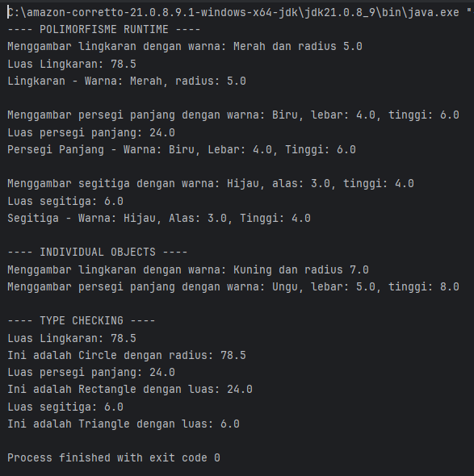
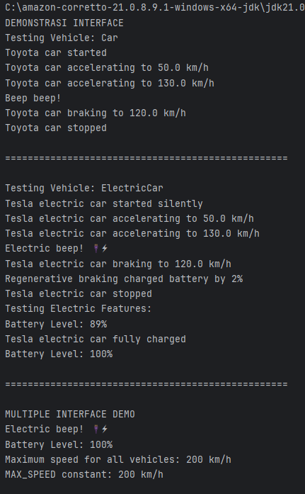
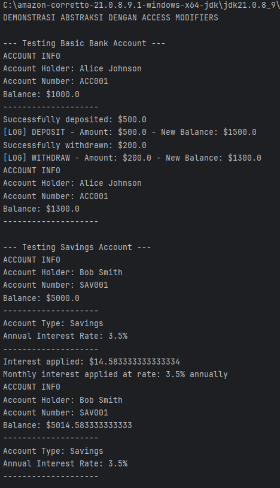
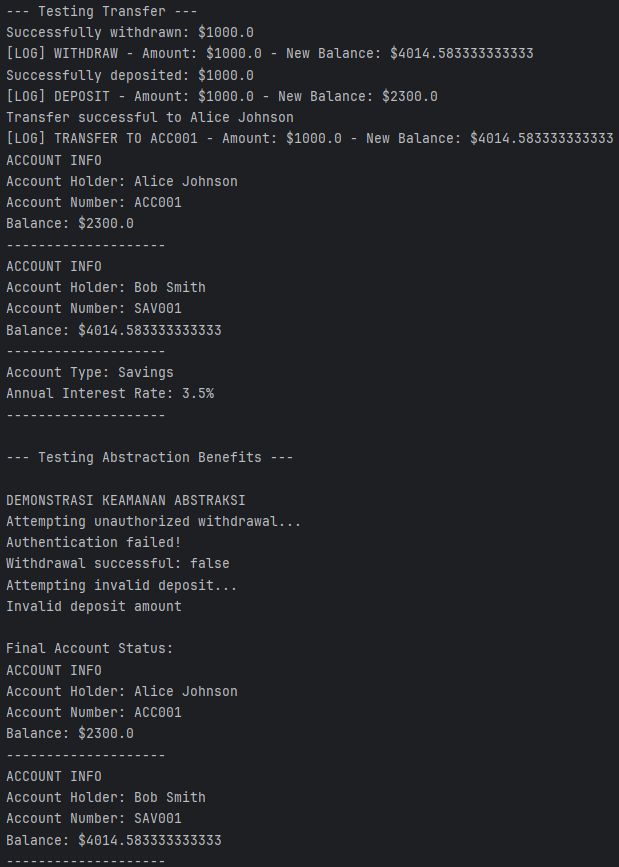
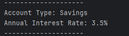

# Laporan Modul 8: Abstract Class & Interface

**Mata Kuliah: Praktikum Pemrograman Berorientasi Objek**

**Nama: Muhammad Alif arrayyan**

**NIM: 2024573010085**

**Kelas: TI-2E**

---

### Pendahuluan
Dalam pengembangan perangkat lunak berbasis Object Oriented Programming (OOP), abstraksi adalah salah satu prinsip utama untuk menyembunyikan detail implementasi yang kompleks dan hanya menampilkan fungsionalitas penting kepada pengguna. Dua mekanisme utama untuk mencapai abstraksi penuh maupun parsial di Java adalah **Abstract Class** dan **Interface**.

**Abstract Class** adalah kelas yang tidak dapat diinstansiasi secara langsung menjadi objek. Kelas ini berfungsi sebagai kerangka dasar bagi kelas-kelas turunannya. Abstract class dapat memiliki method abstrak (tanpa body) dan method konkrit (dengan body). Tujuannya adalah mendefinisikan karakteristik umum yang akan dibagi ke subclass, sambil memaksakan subclass untuk mengimplementasikan logika spesifik tertentu.

**Interface** adalah struktur yang sepenuhnya abstrak (sebelum Java 8) yang hanya berisi deklarasi method tanpa implementasi dan konstanta. Interface bertindak sebagai "kontrak" yang harus dipenuhi oleh kelas yang mengimplementasikannya. Berbeda dengan class yang hanya mendukung *single inheritance*, interface memungkinkan *multiple inheritance* (sebuah class dapat mengimplementasikan banyak interface).

### Jenis-jenis Abstraksi
**1. Abstraksi data (data abstraction)**

Data abstraction terjadi ketika data objek tidak terlihat oleh dunia luar. Akses ke data objek (jika diperlukan) disediakan melalui beberapa metode. Abstraksi data memastikan detail internal objek tetap tersembunyi, sementara fungsionalitas yang diperlukan dapat diakses.

**2. Abstraksi proses (process abstraction)**

Process abstraction terjadi ketika implementasi internal dari berbagai fungsi yang terlibat dalam operasi user disembunyikan. Artinya, detail tentang bagaimana fungsi tertentu diimplementasikan tidak terlihat oleh user, hanya hasil akhirnya yang penting.

### Contoh Abstraksi
Contoh dari abstraksi adalah penggunaan aplikasi pengolah kata, seperti Microsoft Word. Microsoft Word adalah aplikasi pengolah kata untuk membuat, mengedit, dan memformat dokumen teks. Aplikasi ini menyediakan berbagai fitur seperti pengecekan ejaan dan tata bahasa, format teks, penambahan gambar, dan pembuatan tabel.

_Beberapa fitur yang ditawarkan Microsoft Word yaitu:_
1. Pembuatan dan pengeditan Dokumen
2. Pengecekan ejaan dan tata bahasa
3. Insert object
4. Template dan desain dokumen
Microsoft Word mengabstraksikan kompleksitas pemrosesan fitur-fitur di atas. User tidak perlu memahami detail teknis tentang pemformatan teks atau pengelolaan dokumen. Sebaliknya, mereka hanya perlu menggunakan user interface intuitif untuk mencapai hasil yang diinginkan. Proses seperti rendering teks, penanganan margin dan spasi, serta konversi format file, semua diabstraksikan oleh aplikasi.

### Cara Implementasi
1. Abstract Classes - Class yang tidak dapat diinstansiasi langsung dan mengandung abstract methods
2. Interfaces - Kontrak yang mendefinisikan method yang harus diimplementasikan
3. Access Modifiers - Menggunakan private/protected untuk menyembunyikan detail implementasi

#### Fungsi Abstraksi
1. Menyederhanakan kompleksitas: abstraksi membantu dalam menyederhanakan sistem yang kompleks. Dengan menyembunyikan detail internal dan menampilkan hanya fungsionalitas yang diperlukan, abstraksi membantu programmer untuk tidak terbebani oleh kompleksitas yang tidak relevan.
2. Meningkatkan modularitas: abstraksi mendukung pembuatan modul yang dapat digunakan kembali. Dengan mendefinisikan interface yang jelas, modul dapat dikembangkan secara independen dan digunakan dalam berbagai konteks tanpa perlu mengetahui detail internalnya.
3. Memudahkan maintenance: kode yang mengimplementasikan abstraksi lebih mudah dipelihara dan diperbarui. Perubahan pada implementasi internal suatu modul tidak memengaruhi modul lain yang menggunakan interface abstrak tersebut.
4. Meningkatkan keamanan: dengan menyembunyikan detail internal, abstraksi akan meningkatkan keamanan software. Hal ini mencegah akses tidak sah ke data internal atau manipulasi fungsi internal.
5. Memfasilitasi kolaborasi: dalam proyek besar dengan banyak developer, abstraksi memungkinkan tim untuk bekerja secara paralel pada komponen yang berbeda. Setiap tim fokus pada tugasnya sendiri tanpa perlu memahami keseluruhan sistem.
6. Mendukung polimorfisme dan penggunaan ulang kode: abstraksi mendukung penggunaan polimorfisme, di mana objek dari class berbeda dapat diakses melalui interface yang sama. Ini meningkatkan fleksibilitas dan penggunaan ulang kode.
7. Mendukung pemisahan antara interface dan implementasi: abstraksi bisa memisahkan apa yang dilakukan suatu objek (interface) dan bagaimana hal itu dilakukan (implementasi). Ini memudahkan pemahaman dan pengembangan software.

**Tujuan Penggunaan Abstract Class & Interface**

1. `Standardization` - Menetapkan standar method yang harus dimiliki oleh kelas-kelas turunannya.
2. `Security` - Menyembunyikan detail implementasi internal dan hanya mengekspos method yang diperlukan.
3. `Multiple Inheritance Support` - Melalui Interface, Java mengatasi keterbatasan single inheritance pada class.
4. `Loose Coupling` - Mengurangi ketergantungan antar komponen kode, memudahkan pemeliharaan.
5. `Polymorphism Support` - Memungkinkan objek dari berbagai kelas diperlakukan sama melalui referensi interface atau abstract class.

**Perbedaan Dasar Implementasi**

1. **Abstract Class**: Menggunakan kata kunci `extends`. Bisa memiliki method dengan body. Variabel bisa berupa non-static dan non-final.
2. **Interface**: Menggunakan kata kunci `implements`. Secara default method adalah abstrak (kecuali default/static method di Java 8+). Variabel secara otomatis adalah `public static final`.


### Sebelum Memulai Praktikum
Buat sebuah package baru dengan nama `modul_8` di dalam folder `src`, kemudian, selesaikan seluruh praktikum dan latihan dari modul ini di dalam package `modul_8`.

---
## Praktikum 1: Memahami Abstract Class dan Abstract Method

---
### Abstract Class
Abstract class adalah kelas yang tidak dapat diinstansiasi (tidak bisa dibuat objeknya langsung). Kelas ini berfungsi sebagai kerangka dasar (template) untuk kelas-kelas turunannya.

**Ciri-ciri Abstract Class:**
1. Dideklarasikan dengan keyword abstract
2. Tidak bisa dibuat objeknya dengan new
3. Dapat memiliki method abstrak dan method konkret (biasa)
4. Dapat memiliki constructor, field, dan method seperti kelas biasa

**Abstract Method**

Abstract method adalah method yang hanya dideklarasikan tanpa implementasi (tanpa body). Implementasinya wajib diberikan oleh subclass yang mewarisinya.

`Ciri-ciri Abstract Method:`
* Hanya deklarasi tanpa body {}
* Harus berada dalam abstract class
* Subclass wajib mengoverride method abstrak ini
* Dideklarasikan dengan keyword abstract

`Tujuan:`
Memahami konsep dan implementasi abstract class dan abstract method.

`Langkah-langkah:`
1. Buat sebuah package baru di dalam package `modul_8` dengan nama `praktikum_1`
2. Buat abstract class `Shape`:
```java
package modul_8.praktikum_1;

public abstract class Shape {
    protected String color;
    protected boolean filled;

    // Konstruktor
    public Shape(String color, boolean filled) {
        this.color = color;
        this.filled = filled;
    }

    // Abstract methods - harus diimplementasikan subclass
    public abstract double calculateArea();
    public abstract double calculatePerimeter();

    // Concrete methods - sudah memiliki implementasi
    public String getColor() {
        return color;
    }

    public void setColor(String color) {
        this.color = color;
    }

    public boolean isFilled() {
        return filled;
    }

    public void setFilled(boolean filled) {
        this.filled = filled;
    }

    // Concrete method yang bisa dioverride
    public void displayInfo() {
        System.out.println("Shape Color: " + color);
        System.out.println("Filled: " + filled);
    }
}
```

3. Buat class `Circle` yang mewarisi `Shape`:
```java
package modul_8.praktikum_1;

public class Circle extends Shape {
    private double radius;

    public Circle(String color, boolean filled, double radius) {
        super(color, filled);
        this.radius = radius;
    }

    // Implementasi abstract methods
    @Override
    public double calculateArea() {
        return Math.PI * radius * radius;
    }

    @Override
    public double calculatePerimeter() {
        return 2 * Math.PI * radius;
    }

    // Override concrete method
    @Override
    public void displayInfo() {
        System.out.println("CIRCLE");
        super.displayInfo();
        System.out.println("Radius: " + radius);
        System.out.println("Area: " + calculateArea());
        System.out.println("Perimeter: " + calculatePerimeter());
        System.out.println("==============");
    }

    // Method khusus Circle
    public double getDiameter() {
        return 2 * radius;
    }
}
```

4. Buat class `Rectangle` yang mewarisi `Shape`:
```java
package modul_8.praktikum_1;

public class Rectangle extends Shape {
    private double width;
    private double height;

    public Rectangle(String color, boolean filled, double width, double height) {
        super(color, filled);
        this.width = width;
        this.height = height;
    }

    // Implementasi abstract methods
    @Override
    public double calculateArea() {
        return width * height;
    }

    @Override
    public double calculatePerimeter() {
        return 2 * (width + height);
    }

    // Override concrete method
    @Override
    public void displayInfo() {
        System.out.println("RECTANGLE");
        super.displayInfo();
        System.out.println("Width: " + width);
        System.out.println("Height: " + height);
        System.out.println("Area: " + calculateArea());
        System.out.println("Perimeter: " + calculatePerimeter());
        System.out.println("------------");
    }

    // Method khusus Rectangle
    public boolean isSquare() {
        return width == height;
    }
}
```
5. Buat class `AbstractClassTest` untuk testing:
```java
package modul_8.praktikum_1;

public class AbstractClassTest {
    public static void main(String[] args) {
        // Tidak bisa membuat instance abstract class langsung
        // Shape shape = new Shape("Red", true); // ERROR!

        // Membuat objects dari concrete subclasses
        Circle circle = new Circle("Red", true, 5.0);
        Rectangle rectangle = new Rectangle("Blue", false, 4.0, 6.0);

        System.out.println("DEMONSTRASI ABSTRACT CLASS");

        // Menggunakan abstract class reference
        Shape shape1 = circle;
        Shape shape2 = rectangle;

        // Polymorphic calls
        shape1.displayInfo();
        System.out.println();

        shape2.displayInfo();
        System.out.println();

        // Mengakses method khusus subclass melalui casting
        System.out.println("Circle Diameter: " + circle.getDiameter());
        System.out.println("Is Rectangle Square? " + rectangle.isSquare());
        System.out.println();

        // Array of Shapes - demonstrating polymorphism
        System.out.println("ARRAY OF SHAPES");
        Shape[] shapes = new Shape[3];
        shapes[0] = new Circle("Green", true, 3.0);
        shapes[1] = new Rectangle("Yellow", true, 5.0, 5.0);
        shapes[2] = new Circle("Purple", false, 7.0);

        double totalArea = 0;
        for (Shape shape : shapes) {
            shape.displayInfo();
            totalArea += shape.calculateArea(); // Abstract method call
            System.out.println();
        }

        System.out.println("Total Area of All Shapes: " + totalArea);
    }
}
```

6. Jalankan program dan amati hasilnya.
7. Coba buat instance abstract class langsung dan lihat error yang terjadi.

### Hasil Output


#### Analisis
Pada praktikum ini, konsep **Abstract Class** diterapkan untuk membuat kerangka kerja bangun datar. Berikut adalah poin-poin analisisnya:

1. Penggunaan `abstract class`:
Kelas `Shape` dideklarasikan sebagai abstract. Ini berarti kita tidak bisa membuat objek langsung dari kelas Shape (misalnya new `Shape()`). Hal ini logis karena "Bentuk" adalah konsep abstrak; kita hanya bisa membuat objek dari bentuk yang spesifik (seperti Lingkaran atau Persegi Panjang).


2. Peran `abstract method getArea()`:
Di dalam `Shape`, terdapat method `public abstract double getArea()`;. Method ini tidak memiliki body (implementasi). Tujuannya adalah untuk memaksa setiap kelas turunan (`Circle` dan `Rectangle`) untuk menyediakan rumus luasnya masing-masing. Jika `Circle` tidak meng-override method ini, maka kompilasi akan gagal.

3. Inheritance & Overriding:

* `Circle` mengimplementasikan getArea dengan rumus $\pi \times r^2$.

* `Rectangle` mengimplementasikan `getArea` dengan rumus $panjang \times lebar$.
Ini menunjukkan bagaimana satu method yang sama (getArea) memiliki perilaku yang berbeda tergantung pada subclass-nya.

4. Polimorfisme:
Di kelas `MainShape`, variabel bertipe parent (`Shape`) digunakan untuk menampung objek child (`new Circle(...)`). Saat `displayInfo()` dipanggil, program menggunakan method dari parent (karena diwariskan), tetapi saat `getArea()` dipanggil, program secara otomatis menggunakan implementasi dari masing-masing child.


## Praktikum 2: Interface (Studi Kasus Kendaraan)

`Tujuan:`
Menggunakan Interface untuk mendefinisikan perilaku umum kendaraan tanpa terikat pada satu hierarki kelas.

`Langkah-langkah:`

1. Buat package modul_8.praktikum_2.

   2. Buat interface `Vehicle`.
```java
package modul_8.praktikum_2;

public interface Vehicle {
    // Constant fields (public static final by default)
    int MAX_SPEED = 200;

    // Abstract methods (public abstract by default)
    void start();
    void stop();
    void accelerate(double speed);
    void brake();

    // Default method (Java 8+)
    default void honk() {
        System.out.println("Beep beep!");
    }

    // Static method (Java 8+)
    static void displayMaxSpeed() {
        System.out.println("Maximum speed for all vehicles: " + MAX_SPEED + " km/h");
    }
}
```

3. Buat Interface `Electric`.
```java
package modul_8.praktikum_2;

public interface Electric {
    void charge();
    int getBatteryLevel();
    void setBatteryLevel(int level);

    default void displayBatteryInfo() {
        System.out.println("Battery Level: " + getBatteryLevel() + "%");
    }
}
```

4. Buat class `Car` yang mengimplementasi `Vehicle`:

```java
package modul_8.praktikum_2;

public class Car implements Vehicle {
    private String brand;
    private double currentSpeed;
    private boolean isRunning;

    public Car(String brand) {
        this.brand = brand;
        this.currentSpeed = 0;
        this.isRunning = false;
    }

    @Override
    public void start() {
        if (!isRunning) {
            isRunning = true;
            System.out.println(brand + " car started");
        } else {
            System.out.println(brand + " car is already running");
        }
    }

    @Override
    public void stop() {
        if (isRunning) {
            isRunning = false;
            currentSpeed = 0;
            System.out.println(brand + " car stopped");
        } else {
            System.out.println(brand + " car is already stopped");
        }
    }

    @Override
    public void accelerate(double speed) {
        if (isRunning) {
            currentSpeed += speed;
            if (currentSpeed > MAX_SPEED) {
                currentSpeed = MAX_SPEED;
            }
            System.out.println(brand + " car accelerating to " + currentSpeed + " km/h");
        } else {
            System.out.println("Please start the car first");
        }
    }

    @Override
    public void brake() {
        if (currentSpeed > 0) {
            currentSpeed -= 10;
            if (currentSpeed < 0) currentSpeed = 0;
            System.out.println(brand + " car braking to " + currentSpeed + " km/h");
        } else {
            System.out.println(brand + " car is already stopped");
        }
    }

    // Getter methods
    public String getBrand() { return brand; }
    public double getCurrentSpeed() { return currentSpeed; }
    public boolean isRunning() { return isRunning; }
}
```

5. Buat class ElectricCar yang mengimplementasi kedua interface:
```java
package modul_8.praktikum_2;

public class ElectricCar implements Vehicle, Electric {
    private String brand;
    private double currentSpeed;
    private boolean isRunning;
    private int batteryLevel;

    public ElectricCar(String brand) {
        this.brand = brand;
        this.currentSpeed = 0;
        this.isRunning = false;
        this.batteryLevel = 100; // Fully charged
    }

    // Implement Vehicle interface methods
    @Override
    public void start() {
        if (isRunning) {
            System.out.println(brand + " electric car is already running");
        } else if (batteryLevel > 0) {
            isRunning = true;
            System.out.println(brand + " electric car started silently");
        } else {
            System.out.println("Cannot start. Battery is empty. Please charge first.");
        }
    }

    @Override
    public void stop() {
        if (isRunning) {
            isRunning = false;
            currentSpeed = 0;
            System.out.println(brand + " electric car stopped");
        } else {
            System.out.println(brand + " electric car is already stopped");
        }
    }

    @Override
    public void accelerate(double speed) {
        if (isRunning) {
            if (batteryLevel > 0) {
                currentSpeed += speed;
                // Battery consumption
                batteryLevel -= (int) (speed / 10);
                if (currentSpeed > MAX_SPEED) {
                    currentSpeed = MAX_SPEED;
                }
                System.out.println(brand + " electric car accelerating to " + currentSpeed + " km/h");
            } else {
                System.out.println("Cannot accelerate. Battery is empty.");
            }
        } else {
            System.out.println("Please start the car first");
        }
    }

    @Override
    public void brake() {
        if (currentSpeed > 0) {
            currentSpeed -= 10;
            if (currentSpeed < 0) currentSpeed = 0;
            System.out.println(brand + " electric car braking to " + currentSpeed + " km/h");

            // Regenerative braking: charge battery slightly
            if (batteryLevel < 100) {
                batteryLevel += 2;
                System.out.println("Regenerative braking charged battery by 2%");
            }
        } else {
            System.out.println(brand + " electric car is already stopped");
        }
    }

    // Override default method
    @Override
    public void honk() {
        System.out.println("Electric Beep! ⚡");
    }

    // Implement Electric interface methods
    @Override
    public void charge() {
        batteryLevel = 100;
        System.out.println(brand + " electric car fully charged");
    }

    @Override
    public int getBatteryLevel() {
        return batteryLevel;
    }

    @Override
    public void setBatteryLevel(int level) {
        if (level >= 0 && level <= 100) {
            batteryLevel = level;
        } else {
            System.out.println("Battery level must be between 0 and 100!");
        }
    }

    // Getter methods
    public String getBrand() { return brand; }
    public double getCurrentSpeed() { return currentSpeed; }
    public boolean isRunning() { return isRunning; }
}
```

6. Buat `InterFaceTest` untuk Testing:
```java
package modul_8.praktikum_2;

public class InterfaceTest {
    public static void main(String[] args) {
        System.out.println("DEMONSTRASI INTERFACE");

        // Test regular car
        Car car = new Car("Toyota");
        testVehicle(car);

        System.out.println("\n" + "=".repeat(50) + "\n");

        // Test electric car
        ElectricCar electricCar = new ElectricCar("Tesla");
        testVehicle(electricCar);
        testElectric(electricCar);

        System.out.println("\n" + "=".repeat(50) + "\n");

        // Demonstrasi multiple interface implementation
        System.out.println("MULTIPLE INTERFACE DEMO");
        electricCar.honk(); // Overridden default method
        electricCar.displayBatteryInfo(); // Default method from Electric interface

        // Static method call
        Vehicle.displayMaxSpeed();

        // Interface constants
        System.out.println("MAX_SPEED constant: " + Vehicle.MAX_SPEED + " km/h");
    }

    public static void testVehicle(Vehicle vehicle) {
        System.out.println("Testing Vehicle: " + vehicle.getClass().getSimpleName());
        vehicle.start();
        vehicle.accelerate(50);
        vehicle.accelerate(80);
        vehicle.honk(); // Default method
        vehicle.brake();
        vehicle.stop();
    }

    public static void testElectric(Electric electric) {
        System.out.println("Testing Electric Features:");
        electric.displayBatteryInfo();
        electric.charge();
        electric.displayBatteryInfo();
    }
}
```

7. Jalankan program dan amati:
* Implementasi multiple interface
* Penggunaan default dan static methods
* Perbedaan antara abstract class dan interface

### Hasil Output


##### Analisis Praktikum 2: Interface (Studi Kasus Kendaraan)

## 1. Tinjauan Umum
Pada praktikum ini, dilakukan implementasi konsep **Interface** untuk memodelkan perilaku kendaraan. Berbeda dengan *Abstract Class* yang menekankan hierarki "is-a", Interface menekankan pada perilaku "can-do". Fokus utama percobaan ini adalah simulasi **Multiple Implementation**, di mana sebuah class dapat mengadopsi perilaku dari banyak interface sekaligus.

## 2. Analisis Komponen Kode

##### A. Penggunaan Interface (`Vehicle` & `Electric`)
Interface bertindak sebagai kontrak yang harus dipenuhi oleh class yang mengimplementasikannya.

- **Interface `Vehicle`:**
    - Mendefinisikan perilaku dasar kendaraan: `start()`, `stop()`, `accelerate()`, `brake()`.
    - **Fitur Java 8:** Menggunakan `default method` pada `honk()`. Ini memungkinkan interface memiliki method dengan *body* (isi), sehingga class implementasi tidak wajib meng-override.
    - **Konstanta:** `MAX_SPEED` secara otomatis bersifat `public static final`.
- **Interface `Electric`:**
    - Memisahkan fitur kelistrikan (`charge`, `batteryLevel`) dari fitur dasar kendaraan. Ini menerapkan prinsip *Separation of Concerns* (pemisahan tanggung jawab).

##### B. Implementasi Single Interface (`Car`)
Class `Car` merepresentasikan kendaraan konvensional.

- Hanya mengimplementasikan `Vehicle`.
- Menggunakan method `honk()` bawaan dari interface (mencetak "Beep beep!").
- Logika `accelerate` dan `brake` berjalan standar tanpa mempedulikan konsumsi energi.

##### C. Implementasi Multiple Interface (`ElectricCar`)
Class ini adalah inti dari percobaan, menunjukkan bagaimana Java menangani pewarisan sifat ganda.

- **Deklarasi:** `public class ElectricCar implements Vehicle, Electric`.
- **Logika Kompleks:**
    - **Konsumsi Energi:** Saat `accelerate()` dipanggil, variabel `batteryLevel` berkurang seiring penambahan kecepatan.
    - **Regenerative Braking:** Saat `brake()` dipanggil, selain mengurangi kecepatan, method ini juga menambah sedikit daya baterai (+2%).
- **Overriding Default Method:** Class ini melakukan *override* pada method `honk()` menjadi "Electric Beep! ⚡".

##### 3. Konsep Polimorfisme
Pada class `InterfaceTest`, terjadi penerapan Polimorfisme melalui method:

`public static void testVehicle(Vehicle vehicle)`

- Method ini menerima parameter bertipe `Vehicle`.
- Baik objek `Car` maupun `ElectricCar` dapat diproses oleh method ini karena keduanya mengimplementasikan `Vehicle`.
- Namun, objek `Car` **tidak dapat** diproses oleh method `testElectric` karena `Car` tidak memiliki kontrak dengan interface `Electric`.

## Praktikum 3: Abstraksi dengan Access Modifiers
`Tujuan:`
Memahami bagaimana access modifiers membantu dalam mencapai abstraksi.

`Langkah-langkah:`
1. Buat sebuah package baru di dalam package `modul_8` dengan nama `praktikum_3`
2. Buat class `BankAccount` yang mengimplementasi abstraksi:
```java
package modul_8.praktikum_3;

public class BankAccount {
    // Private fields - hidden from outside world
    private double balance;
    private String accountNumber;
    private String accountHolder;
    private String password;

    // Public constructor
    public BankAccount(String accountNumber, String accountHolder, double initialBalance, String password) {
        this.accountNumber = accountNumber;
        this.accountHolder = accountHolder;
        this.balance = initialBalance;
        this.password = password;
        this.logTransaction("INIT", initialBalance, initialBalance);
    }

    // Public methods/interface to the outside world
    public double getBalance() {
        return balance;
    }

    public String getAccountNumber() {
        return accountNumber;
    }

    public String getAccountHolder() {
        return accountHolder;
    }

    public void deposit(double amount) {
        if (amount > 0) {
            double oldBalance = balance;
            balance += amount;
            System.out.println("Successfully deposited: $" + amount);
            logTransaction("DEPOSIT", amount, oldBalance);
        } else {
            System.out.println("Invalid deposit amount");
        }
    }

    public boolean withdraw(double amount, String inputPassword) {
        if (authenticate(inputPassword)) {
            if (amount > 0 && balance >= amount) {
                double oldBalance = balance;
                balance -= amount;
                System.out.println("Successfully withdrawn: $" + amount);
                logTransaction("WITHDRAW", amount, oldBalance);
                return true;
            } else {
                System.out.println("Invalid amount or insufficient funds");
                return false;
            }
        } else {
            System.out.println("Authentication failed!");
            return false;
        }
    }

    public boolean transfer(BankAccount recipient, double amount, String inputPassword) {
        if (withdraw(amount, inputPassword)) {
            // withdraw() sudah melakukan autentikasi dan pengecekan saldo
            recipient.deposit(amount);
            logTransaction("TRANSFER to " + recipient.getAccountHolder(), amount, balance);
            return true;
        }
        return false;
    }

    // Private method - hidden implementation detail
    private boolean authenticate(String inputPassword) {
        return this.password.equals(inputPassword);
    }

    // Private method - logging implementation detail
    private void logTransaction(String type, double amount, double oldBalance) {
        System.out.println("[LOG] " + type + " - Amount: $" + amount + " - New Balance: $" + this.balance + " (Old Balance: $" + oldBalance + ")");
    }

    // Protected method - accessible within package and subclasses
    protected void applyInterest(double rate) {
        double interest = balance * (rate / 100);
        double oldBalance = balance;
        balance += interest;
        System.out.println("Interest applied: $" + interest);
        logTransaction("INTEREST", interest, oldBalance);
    }

    // Public method to expose non-sensitive info
    public void displayAccountInfo() {
        System.out.println("[ACCOUNT INFO]");
        System.out.println("Account Holder: " + accountHolder);
        System.out.println("Account Number: " + accountNumber);
        System.out.println("Balance: $" + balance);
    }
}
```

3. Buat class `SavingsAccount` yang mewarisi `BankAccount`:
```java
package modul_8.praktikum_3;

public class SavingsAccount extends BankAccount {
    private double interestRate;

    public SavingsAccount(String accountNumber, String accountHolder,
                          double initialBalance, String password, double interestRate) {
        super(accountNumber, accountHolder, initialBalance, password);
        this.interestRate = interestRate;
    }

    // Public method to apply interest
    public void applyMonthlyInterest() {
        // Calling protected method from parent
        System.out.println("Monthly interest applied at rate: " + interestRate + "% annually");
        applyInterest(interestRate / 12);
    }

    @Override
    public void displayAccountInfo() {
        super.displayAccountInfo();
        System.out.println("Account Type: Savings");
        System.out.println("Annual Interest Rate: " + interestRate + "%");
        System.out.println("----------");
    }
}
```

4. Buat class `AbstractionTest` untuk testing:
```java
package modul_8.praktikum_3;

public class AbstractionTest {
    public static void main(String[] args) {
        System.out.println("DEMONSTRASI ABSTRAKSI DENGAN ACCESS MODIFIERS");

        // Create accounts
        BankAccount account1 = new BankAccount("ACC001", "Alice Johnson", 1000.0, "pass123");
        SavingsAccount account2 = new SavingsAccount("SAV001", "Bob Smith", 5000.0, "save456", 3.5);

        // Test public interface
        System.out.println("\n--- Testing Basic Bank Account ---");
        account1.displayAccountInfo();
        account1.deposit(500.0);
        account1.withdraw(200.0, "pass123");
        account1.displayAccountInfo();

        System.out.println("\n--- Testing Savings Account ---");
        account2.displayAccountInfo();
        account2.applyMonthlyInterest();
        account2.displayAccountInfo();

        System.out.println("\n--- Testing Transfer ---");
        account2.transfer(account1, 1000.0, "save456");
        account1.displayAccountInfo();
        account2.displayAccountInfo();

        System.out.println("\n--- Testing Abstraction Benefits ---");
        // Cannot access private members directly
        // System.out.println(account1.balance); // ERROR - private field
        // System.out.println(account1.password); // ERROR - private field

        // Cannot call private methods
        // Cannot call authenticate("pass123"); // ERROR - private method
        // Cannot call account1.logTransaction("TEST", 100); // ERROR - private method

        // Protected method is accessible through public interface in subclass
        // account1.applyInterest(5.0); // ERROR - protected method not accessible outside hierarchy

        System.out.println("\nDEMONSTRASI KEAMANAN ABSTRAKSI");

        // Attempt unauthorized access
        System.out.print("Attempting unauthorized withdrawal...: ");
        boolean success = account1.withdraw(1000.0, "wrongpassword");
        System.out.println("Withdrawal successful: " + success);

        // Attempting invalid deposit
        System.out.print("Attempting invalid deposit...: ");
        account1.deposit(-100.0); // Invalid amount

        System.out.println("\nFinal Account Status:");
        account1.displayAccountInfo();
        account2.displayAccountInfo();
    }
}
```

### Hasil Output




## Analisis Percobaan 3: Abstraksi dengan Access Modifiers

### 1. Tinjauan Umum
Pada praktikum ini, fokus utama adalah penerapan **Abstraksi Data** melalui mekanisme **Encapsulation** (pembungkusan). Tujuannya adalah menyembunyikan detail implementasi yang rumit atau sensitif (seperti password dan saldo) dari dunia luar, dan hanya menyediakan metode-metode tertentu yang aman untuk berinteraksi dengan data tersebut.

### 2. Analisis Komponen Kode

#### A. Penggunaan `Private` (Data Hiding)
Access modifier `private` digunakan pada komponen paling sensitif di class `BankAccount`.
- **Atribut:** `balance`, `accountNumber`, `password` bersifat private.
    - **Analisis:** Ini mencegah manipulasi langsung dari luar. Misalnya, `account1.balance = 1000000;` akan menyebabkan error. Saldo hanya bisa berubah melalui prosedur resmi (`deposit` atau `withdraw`).
- **Method Internal:** `authenticate()` dan `logTransaction()` bersifat private.
    - **Analisis:** Dunia luar tidak perlu tahu bagaimana cara sistem mencocokkan password atau mencatat log. Mereka hanya perlu tahu transaksi berhasil atau gagal. Ini adalah inti dari abstraksi: **menyembunyikan kompleksitas**.

#### B. Penggunaan `Public` (Interface)
Access modifier `public` digunakan sebagai "jendela" atau antarmuka bagi pengguna class.
- **Method:** `deposit()`, `withdraw()`, `transfer()`.
- **Analisis:** Method ini bertindak sebagai **Gerbang Keamanan**. Sebelum saldo diubah, method ini melakukan validasi terlebih dahulu (misalnya: mengecek apakah password benar lewat `withdraw`, atau apakah jumlah uang positif lewat `deposit`).

#### C. Penggunaan `Protected` (Inheritance Access)
Access modifier `protected` digunakan pada method `applyInterest()`.
- **Analisis:** Modifier ini memberikan akses terbatas.
    - Dunia luar (`AbstractionTest`) **tidak bisa** memanggil `applyInterest` secara langsung.
    - Namun, subclass (`SavingsAccount`) **bisa** mengaksesnya. Hal ini terlihat pada method `applyMonthlyInterest()` di class `SavingsAccount` yang memanggil method `applyInterest()` milik induknya.

### 3. Alur Logika dan Validasi

#### Mekanisme Keamanan (Security)
Pada method `withdraw`, terdapat logika validasi bertingkat:
1.  **Cek Autentikasi:** Memanggil `authenticate(inputPassword)`. Jika password salah, transaksi ditolak.
2.  **Cek Saldo:** Memastikan `balance >= amount`.
3.  **Eksekusi:** Jika kedua syarat terpenuhi, baru saldo dikurangi.

#### Polimorfisme pada Constructor
Class `SavingsAccount` menggunakan keyword `super(...)` di dalam constructor-nya. Ini memastikan bahwa ketika akun tabungan dibuat, inisialisasi dasar (setting nama, nomor rekening, saldo awal) tetap ditangani oleh logika class induk (`BankAccount`), menjaga konsistensi data.
ilitas Warisan:** Modifier `protected` memungkinkan pembagian logika khusus kepada class turunan tanpa membocorkannya ke publik.


## Kesimpulan
Berdasarkan praktikum yang telah dilakukan dalam modul ini, dapat disimpulkan bahwa Abstraksi merupakan pilar utama dalam Pemrograman Berorientasi Objek (PBO) yang berfungsi untuk menyederhanakan kompleksitas sistem dengan cara menyembunyikan detail implementasi dan hanya menampilkan fungsionalitas penting kepada pengguna.

Modul ini mendemonstrasikan tiga mekanisme utama untuk mencapai abstraksi di Java:

**Abstract Class (Generalisasi Hierarki)**: Digunakan untuk membuat kerangka dasar (template) bagi class-class turunan yang memiliki kemiripan sifat ("is-a relationship"). Abstract class memungkinkan kita mendefinisikan metode yang wajib ada (abstract method) sekaligus metode yang sudah memiliki logika dasar (concrete method), mengurangi duplikasi kode pada subclass.

**Interface (Standarisasi Perilaku)**: Digunakan untuk mendefinisikan kontrak perilaku ("can-do relationship") yang lebih fleksibel tanpa terikat hierarki pewarisan. Praktikum membuktikan bahwa Interface memungkinkan Multiple Implementation, di mana satu objek (seperti ElectricCar) dapat memiliki berbagai peran sekaligus (Vehicle dan Electric), serta mendukung fitur modern seperti default method dan static method.

**Access Modifiers & Encapsulation (Keamanan Data)**: Abstraksi tidak hanya soal struktur class, tetapi juga keamanan data. Penggunaan modifier private menyembunyikan data sensitif (seperti saldo bank), sementara public dan protected menyediakan antarmuka yang aman dan terkontrol. Ini memastikan integritas data tetap terjaga karena akses dari luar harus melalui validasi sistem, bukan manipulasi langsung.

**Inti Pembelajaran**: Kombinasi antara Abstract Class untuk struktur pewarisan, Interface untuk fleksibilitas fitur, dan Access Modifiers untuk keamanan data, memungkinkan pengembang perangkat lunak membangun sistem yang modular (terstruktur), aman, dan mudah dikembangkan (scalable) di masa depan.

## Referensi
1. Java Tutorial - W3Schools — https://www.w3schools.com/java/